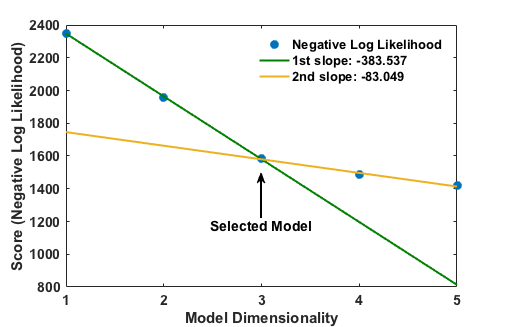

.. _AuxiliaryScripts:

Auxiliary Scripts
==================

.. _LikelihoodMaximization:

lmax.py: Likelihood Maximization
--------------------------------

In addition to the core job types performed through calls directly to ``atesa``, ATESA comes packaged with a separate likelihood maximization (LMax) script for obtaining reaction coordinates (RC's) from aimless shooting output.

The product of aimless shooting is a (large) set of combined variable (CV) values paired with corresponding commitment basins (products or reactants). In order to convert this information into a usable form, likelihood maximization selects a model that describes the reaction progress in terms of relatively few parameters. ATESA supports the intertial likelihood maximization procedure first published in `Peters 2012 <https://doi.org/10.1016/j.cplett.2012.10.051>`_, in addition to the original non-inertial procedure.

Likelihood maximization is invoked from the command line as:

::

	lmax.py -i input_file [-k dimensions | -r dimensions | --automagic [--two_line_threshold ratio]] [-f fixed_cvs] [-s skip] [-q qdot_setting] [-o output_file] [--plots] [--quiet]
	
`-i input_file`
	The only strictly required argument for lmax.py, `input_file` should point to the aimless shooting output file of interest. Usually, this should be the longest "decorrelated" aimless shooting output file in the target working directory (named as "as_decorr_<length>.out", where <length> is the number of shooting points included before decorrelating). Decorrelated output files are produced automatically when using the information error convergence criterion criterion with aimless shooting, but otherwise they can be produced by running a new aimless shooting job with *resample* = True.
	
`-k dimensions`
	This option mutually exclusive with `-r` and `\\-\\-automagic`. The `dimensions` argument should be an integer number of dimensions to include in the final reaction coordinate. This options will always return a reaction coordinate with "k" dimensions (assuming there are at least "k" CVs in the input file), and will arrive at that number of dimensions by comparing every possible k-dimensional combination of CVs. Note that this can take a prohibitively long time when there are a large number of CVs and/or shooting moves to consider, in which case use of either the `-r` or `\\-\\-automagic` option is encouraged instead. When using this option, the order that the CVs appear in the final RC is arbitrary.
	
`-r dimensions`
	This option mutually exclusive with `-k` and `\\-\\-automagic`. The `dimensions` argument should be an integer number of dimensions to include in the final reaction coordinate. This options will always return a reaction coordinate with "r" dimensions (assuming there are at least "r" CVs in the input file), but unlike the `-k` setting, arrives at an r-dimensional result incrementally by finding the best 1-dimensional RC, then the best 2-dimensional RC that includes the coordinate from the best 1-dimensional RC, and so on. This procedure is much faster for high-dimensional data but may not result in the best possible RC, especially in cases where some particular *combination* of CVs is highly predictive of the simulation outcome while the individual CVs are not. The order that the CVs appear in the final RC is indicative of the order in which they were added (leftward terms first).
	
`\\-\\-automagic`
	This option mutually exclusive with `-k` and `-r`. If this argument is given, the dimensionality of the result is determined "automagically" by assessing the relative slopes of best-fit lines on different portions of the scoring data for successively higher-dimensional RCs. The order that the CVs appear in the final RC is indicative of the order in which they were added (leftward terms first). The exact operation of this algorithm is described in more detail in the :ref:`Automagic` section below.
		
	`\\-\\-two_line_threshold ratio`
		Sets the threshold of the ratio of slopes below which the automagic two-line test may pass. See :ref:`Automagic` for details. Default = 0.5
		
`-f fixed_cvs`
	This option specifies one or more CVs that are required in the final RC. For example, `-k 4 -f 12 31` would return the best four-dimensional RC that contains both CV12 and CV31. The number of required CVs specified with this option must be less than or equal to the number given for `-k` or `-r` if those options are given.
	
`-s skip`
	Similar to `-f`, but this option specifies CVs NOT to include in the RC. This can be useful when your dataset includes dimensions that appear to be well-correlated with the commitment basin but that you have some reason to believe should not be included in the model. Can also be used to obtain runners up to the best models produced with the `\\-\\-automagic` and `-r` settings, by running `lmax.py` again and skipping the last dimension added to the model at hand (the right-most term). Obviously, the same CV cannot be specified with both `-f` and `-s` simultaneously.

`-q qdot_setting`
	Specifies the inertial behavior of LMax. Valid options are: `present`, `absent`, and `ignore`. Default is `present`.
	`present` specifies that for each CV in the input file, there is a corresponding rate-of-change (or "qdot") value, such that the input file is formatted as:
	
	::
	
	<basin> <- <CV1> <CV2> ... <CVn> <qdot1> <qdot2> ... <qdotn>
	
	This format is the one created by aimless shooting runs in ATESA when called with the `include_qdot = True` option (which is the default, as is this setting).
	`absent` specifies that the input file does NOT contain rate-of-change values for its CVs; that is, every number in every row of the input file is a separate CV.
	`ignore` specifies that the input file DOES contain rate-of-change values, but that they should be ignored.
	
`-o output_file`
	If this option is given, a new file named `output_file` is written containing the results of the optimization. If this option is not given, the results are instead written directly to the terminal. This option will overwrite existing files.
	
`\\-\\-plots`
	Produces a matplotlib figure for the committor sigmoid (likelihood of committing to the forward basin as a function of the reaction coordinate value) for the final model as a histogram, compared against the theoretical ideal as a line. If *\\-\\-automagic* is provided, also produces ASCII-style plots in the terminal for each step of automagic above four dimensions, if Python package gnuplot is available; see :ref:`Automagic` for details.

`\\-\\-quiet`
	By default, ``lmax.py`` writes one or more progress bars (one for each optimization step) to the terminal. If this option is given, these progress bars are suppressed. Note that the output will still be written to the terminal if no output file is specified with the `-o` option.
	
.. _Automagic:

The Automagic Option
~~~~~~~~~~~~~~~~~~~~

A common problem when attempting to find a suitable reaction coordinate for a given dataset is that the appropriate dimensionality of the final RC cannot be identified in advance. There are several approaches to comparing the "information content" of various models aimed towards penalizing each successive parameter such that only significant improvements are permitted, such as the Bayesian and Akaike information criteria. However, these methods are designed to find the "best" model for a given process, regardless of how many parameters that model contains, whereas for practical reasons useful RCs are usually low-dimensional. That is, while an RC selected using even a highly selective Bayesian information criterion may contain many (*e.g.*, upwards of ten) parameters, a much simpler model (say, of three or four dimensions) is usually sufficient and more useful. This is the motivation behind the "automagic" algorithm. In short, whether automagic is appropriate for your use-case depends on whether you would rather sacrifice a modicum of model accuracy in exchange for a fast and fully automated approach to obtaining a reaction coordinate.

Automagic attempts to include only the most important parameters in the final RC, as defined by the change in model score for each successive parameter. To accomplish this, the algorithm first uses the `-r` approach to model optimization as described above to obtain one- through five-dimensional RCs; then, it fits two lines onto contiguous subsections of the data [1, M] and [M, N] (where N is the dimensionality of the highest-dimensional model yet derived and 2 <= M <= N - 1). The resulting RC is the one containing M dimensions, if and only if the two lines intersect closer to the M'th point than any other point and the ratio of slopes s[M, N]/s[1, M] is at least 0.5 (that is, the slope of the second line is at most 50% that of the first line; this threshold can be overridden using the *two_line_threshold* command line argument or by running lmax.py in a directory containing a settings.pkl object (created by ATESA based on the configuration file) that specifies the option "two_line_threshold"). An example meeting these two criteria is shown here:

This plot (in ASCII form) would be outputted to the terminal at the end of the optimization if the *\\-\\-plots* option were supplied. If the criteria cannot be met, an additional model of dimensionality N+1 is obtained and the process is repeated. If enough dimensions are available, this algorithm will always converge eventually. This approach is very efficient for arriving at a *good* reaction coordinate (though it is by no means guaranteed to be the "best" possible one), though it suffers from two shortcomings:

1. One-dimensional models can never be selected; and
2. The cutoff ratio of slopes is arbitrary (that is, it reflects an arbitrary judgement of what constitutes a sufficient drop in the rate of change of model scores)

.. _RCEval:

rc_eval.py: Reaction Coordinate Evaluation 
------------------------------------------

ATESA also comes with a separate script for evaluating reaction coordinates for each shooting point coordinate file in a given directory. This script should be given an aimless shooting working directory, where it will produce a new file `rc.out` containing the reaction coordinate values of each point, sorted by ascending absolute value (such that points closest to the supposed transition state come first). 

Alternatively, when `extrema = True`, the script skips creating `rc.out` and simply returns the RC values of a the final forward and backward frames of a single accepted trajectory in the working directory. This is useful when preparing for equilibrium path sampling or umbrella sampling jobs, which require the user to specify the range of RC values to sample over.

The syntax is as follows:

::

	rc_eval.py working_directory rc_definition as_out_file [extrema]
	
`working_directory`
	Specifies the aimless shooting working directory in which to operate
	
`rc_definition`
	Defines the reaction coordinate to evaluate for each shooting point. The format is the same as in the `rc_definition` configuration file setting (see :ref:`ReactionCoordinateDefinition`), except that here there must be no whitespace (' ') characters. The identities of CVs are determined from the settings.pkl object stored in the working directory.
	
`as_out_file`
	The path to the aimless shooting output file used to build the reaction coordinate (the *-i* argument for ``lmax.py``. Usually this should be the largest "decorrelated" output file in the aimless shooting working directory.
	
`extrema`
	A boolean, either "True" or "False". If "True", the script skips creating `rc.out` and simply returns the RC values of a the final forward and backward frames of a single accepted trajectory in the working directory. This is useful when preparing for equilibrium path sampling or umbrella sampling jobs, which require the user to specify the range of RC values to sample over. This is the only option with a default value; if it is omitted, it will be set to False.
	
The produced output file `rc.out` is (optionally) used as input for a committor analysis run (see :ref:`CommittorAnalysis`). Note that running this script with `extrema = False` can take a long time if there is a large number of shooting moves in the indicated working directory.

.. _MBAR:

mbar.py: Energy Profiles from US
--------------------------------

The output files from an umbrella sampling (US) run can be converted into a free energy profile by any number of methods, but one of the most ideal is the Multistate Bennett Acceptance Ratio", or "MBAR". ATESA comes with a suitable implementation of MBAR using the `pymbar <https://github.com/choderalab/pymbar>`_ package available from the Chodera lab. If you publish work making use of this script, be sure to cite the appropriate papers described on that page; at minimum, you should cite::

	Shirts M. R. and Chodera, J. D. Statistically optimal analysis of samples from multiple equilibrium states. J. Chem. Phys. 129:124105 (2008). DOI: 10.1063/1.2978177

The basic task in interpreting umbrella sampling data is to "subtract" the effect of the known harmonic restraints on the sampling, leaving only the underlying free energy profile. For a discussion of the exact workings of MBAR, the reader is directed to `the original paper <https://www.ncbi.nlm.nih.gov/pmc/articles/PMC2671659/>`_.

If supported by the local python environment, mbar.py produces several plots: first, a "mean value" plot that shows the derivation from the window center in each data file. This is a diagnostic tool to help identify any problematic regions; if there is no issue, the plot should be a smooth waveform passing through 0 near the middle. Then, it produces a histogram to show the coverage of sampling over the range of the reaction coordinate. There should be no gaps in this plot, or else additional data must be collected to cover the gaps. Finally, it plots the free energy profile itself. All of the data for these plots is also printed the the output file (see the `-o` option below) regardless of whether the plots are shown. In cases where the data exists on a remote server, it may be convenient to copy the necessary files (see following paragraph) to a local directory before running ``mbar.py`` in order to produce these plots automatically.

mbar.py looks for and uses all data files in the present directory whose names begin with "rcwin_" and end with "_us.dat". This matches the output files produced by umbrella sampling with ATESA. The script is called directly in the command line from within the desired working directory as follows:

::

	mbar.py [-k kconst] [-t temp] [-o output] [--min_data min] [--ignore threshold] [--decorr] [--rc_min min] [--rc_max max] [--quiet]
	
`-k kconst`

	The harmonic restraint weight used during umbrella sampling in kcal/mol. This particular implementation of MBAR requires that all of the restraints be identical. The default is equal to the default setting during an ATESA umbrella sampling job. Default = 50
	
`-t temp`

	The temperature at which the simulations were performed, in K. This implementation of MBAR requires that all of the temperatures be identical. The default is equal to the default setting during an ATESA umbrella sampling job. Default = 300
	
`-o output`

	The name of the output file produced by the script. It will be overwritten if it exists. Default = mbar.out
	
`\\-\\-min_data min`

	The minimum number of samples that must be present in a given data file for it to be included in the analysis. This can be useful to exclude results from simulations that did not finish for some reason, but should be used with care. Default = 0
	
`\\-\\-ignore threshold`

	The number of samples from the beginning of each data file to ignore during analysis. This is useful for manually specifying a decorrelation time from the initial coordinates in each window, if desired. Probably should not be used in combination with `\\-\\-decorr`. Default = 1
	
`\\-\\-decorr`

	If this option is given, then the built-in pymbar.timeseries.detectEquilibration and pymbar.timeseries.subsampleCorrelatedData functions are used to attempt to automatically pare the data in each data file down to equilibrated and decorrelated samples. If you don't know what this means, you probably *should* use it. If you publish work that makes use of this option, you must cite (in addition to the aforementioned paper)::
	
	Chodera, J. D. A simple method for automated equilibration detection in molecular simulations. J. Chem. Theor. Comput. 12:1799, 2016. DOI: 10.1021/acs.jctc.5b00784
	
`\\-\\-rc_min min`

	The smallest value of the reaction coordinate to include in the final energy profile. If this option isn't specified, then the smallest window center is used instead (which is usually safe).
	
`\\-\\-rc_max max`

	The largest value of the reaction coordinate to include in the final energy profile. If this option isn't specified, then the largest window center is used instead (which is usually safe).
	
`\\-\\-quiet`

	If this option is given, all the output to the terminal and the display of plots is suppressed, and the only result is the output file.

.. _BoltzmannWeight:

boltzmann_weight.py: Energy Profiles from EPS
---------------------------------------------

The output file from an equilibrium path sampling (EPS) run can be converted into a free energy profile by simply weighting the observed probability of each state (that is, a certain discretized range of RC values) according to the Boltzmann distribution:

.. math::

	∆G = -k_B T ln(p)
	
Where :math:`∆G` is the relative free energy, :math:`k_B T` is the Boltzmann constant times the absolute temperature :math:`T`, and :math:`p` is the relative probability of the state in question.

boltzmann_weight.py is a utility script that automates this calculation for data in the format of an ATESA equilibrium path sampling output file, and stitches together the free energy profiles of adjacent windows to construct the overall free energy profile. It also automates subsampling of the data for bootstrapping in order to obtain error bars. It is called as follows:

::

	boltzmann_weight.py -i input_file [-o output_file] [-t temp] [-n nbins] [-c bootstrapCyc] [-b bootstrapN] [--noplot]
	
`-i input_file`
	Path to the EPS output file containing the data to analyze. This file should be formatted in three columns separated by whitespace:
	
	[EPS window lower boundary] [EPS window upper boundary] [sampled RC value]
	
	Samples from each window do not need to be in contiguous groups of lines, but the first two columns of samples from the same EPS window do need to be identical when rounded to three decimal places in order to be counted as belonging to the same window.
	
`-o output_file`
	Name of the output file to produce, containing the final free energy profile and bootstrapped error if applicable. Default is 'fep.out'.
	
`-t temp`
	The temperature in Kelvin at which to evaluate the free energy profile (that is, :math:`T` in :math:`k_B T`). Default is 300.
	
`-n nbins`
	The number of bins into which each EPS window is divided. Must be an integer. Larger values allow for higher resolution, but also require more data in order to remain smooth. Too-low values of n may provide misleading results, while too-high values will add considerable noise. The user is advised to try a few different values of n before settling on one, in order to get a feel for how it affects the result. Default is 5.
	
`-c bootstrapCyc`
	The number of bootstrapping iterations to perform. Must be an integer. A value of zero turns off bootstrapping. Each iteration subsamples the data in each window to get a new estimate of the free energy profile, and then the standard deviation of the distribution of energy values from across the iterations is provided in the final result. Default is 100.
	
`-b bootstrapN`
	The number of samples to include in each window when bootstrapping. Must be an integer. Default is 25.

`\\-\\-noplot`
	By default, boltzmann_weight.py produces a histogram of the binned data in each window to help assess good overlap between adjacent windows, as well as a plot of the resulting free energy profile using matplotlib, if supported by the interpreter. Providing this option suppresses this behavior.
	
Note that if `\\-\\-noplot` is not provided and a histogram is shown, the plot window must be manually closed before the remainder of the calculation will take place. Similarly, the program will not terminate until the free energy profile plot window is closed.