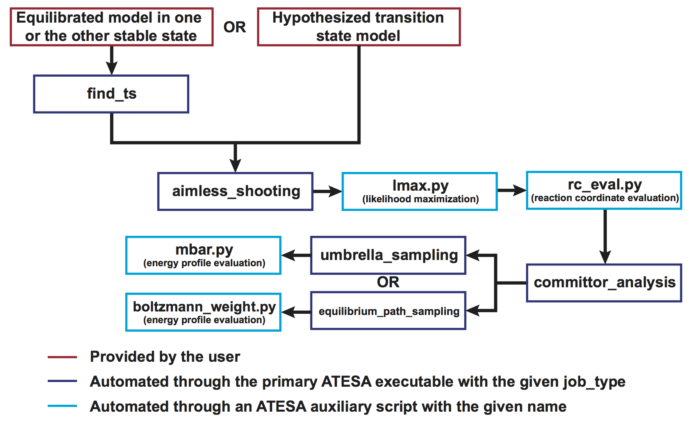

.. _ExampleStudy:

Example Study
=============

This page will detail a complete workflow in ATESA for an example chemical reaction. Not every setting or option applied in this workflow will be appropriate for every application of ATESA; the purpose of this page is to illustrate a particular application of the software to help readers better grasp what working with ATESA is actually like. If you're instead looking for an introduction to the theory underlying any of these steps, check out the :ref:`TheoryAndDefinitions` page.

Where appropriate, we have included complete examples of input, template, and configuration files as well as key results for each step. They can be found in the `'examples' <https://github.com/team-mayes/atesa/tree/master/examples/>`_ folder downloaded with ATESA. Using these example files you can skip actually running each step yourself, if desired. **Not all of the contents of these files will be appropriate for your application**. You will almost certainly need to make changes to some of these files to suit your particular model and computational resources, and some advice on what to change has been included below. Also note that because of the non-deterministic nature of these methods, you should not expect to get exactly identical results if you follow along with these steps yourself. Remember that configuration files are used by submitting an ATESA job as follows::

	atesa example.config

Finally, we have included the approximate computational resources consumed during each step. As with all molecular simulations, your results may vary widely based on the details of your simulation and the computational environment, so be cautious in applying these estimates to your own models. In our case, all performance statistics are based on simulations on the San Diego Supercomputer Center's Comet platform, using single cores (except where otherwise specified) on CPU compute nodes with the following characteristics::

	Intel Haswell Standard Compute Nodes
	Clock speed	2.5 GHz
	Cores/node	24
	DRAM/node	128 GB
	SSD memory/node	320 GB
	
.. _BasicWorkflow:

Basic Workflow
--------------

The following sections will go through each part of a standard ATESA workflow. Following these steps will allow you to start with only a definition of each stable state and a model of one of them (or with a hypothesized transition state model, if preferred), and end with a validated reaction coordinate and a free energy profile along that coordinate connecting the two basins. The workflow of a complete transition path sampling workflow with ATESA is outlined graphically here.

Specifically, in this example we will be following the branch at top left (using ATESA's ``find_ts`` jobtype to identify an initial transition state hypothesis) and using umbrella sampling to obtain the free energy profile.

Initial Setup and the Model
---------------------------

We assume here that ATESA has already been installed on your system. If that is not the case, you should instead start at the :ref:`Installation` page.

The model we will be working with here is the gas-phase decomposition of ethyl chlorosulfite into chloroethane and sulfur dioxide. The mechanism via S\ :sub:`N`\ i reconfiguration has been studied by `Schreiner et al. 1995 <https://pubs.acs.org/doi/pdf/10.1021/jo00086a041>`_. We chose this reaction because the small number of atoms involved facilitate quick simulations and easy visualizations, but ATESA has also been successfully applied for much larger systems, such as enzyme reaction modeling.

	.. figure:: _images/reaction_pathway.png

	The reaction pathway via S\ :sub:`N`\ i reconfiguration for gas phase ethyl chlorosulfite, per Schreiner *et al.* 1995, who demonstrated that this “frontside” attack (where the chlorine bonds to the same side of the carbon as the oxygen departs from) is energetically favorable compared to attacking from the opposite side. Teal: carbon; white: hydrogen; red: oxygen; yellow: sulfur; green: chlorine.

Setup of ATESA for a new system begins with obtaining initial coordinates through whatever means, such as download from a repository like the Protein Databank, or created bespoke using appropriate software. In either case, as with most molecular simulations, the system should first be minimized, heated to the desired temperature, and equilibrated in the desired relaxed state. Excellent tutorials for these steps (among others) using Amber are available `here <https://ambermd.org/tutorials/basic/tutorial0/index.htm>`_. Fluency in basic molecular simulations is assumed of users of ATESA, so be sure you're comfortable before moving forward!

In this case, we produced initial coordinates using `OpenBabel <http://www.cheminfo.org/Chemistry/Cheminformatics/FormatConverter/index.html>`_ with the SMILES string "CCOS(=O)Cl", and then equilibrated the system at 300 K over 10 ps in Amber (a very short time, appropriate for such a small system). This equilibration is done with a hybrid QM/MM model, which we will be using to model the chemical reaction. The topology and equilibration input files and the resulting coordinates can be found in `examples/model_setup <https://github.com/team-mayes/atesa/tree/master/examples/model_setup>`_.

Finding a Transition State
--------------------------

ATESA automates the discovery of suitable initial transition state models using gentle restraints to force rare events to take place, and then identifying the transition state(s) along that forced pathway. The restraints are based only on user-defined definitions of the two stable states that the transition state connects. The complete configuration file used for this job was as follows (remember that many of these options are user- and model-specific!)::

	# examples/find_ts/find_ts.config
	
	job_type = 'find_ts'		# this job is to find a transition state
	topology = 'ethyl_chlorosulfite.prmtop'
	batch_system = 'slurm'
	restart = False
	working_directory = '/scratch/tburgin/ethyl_chlorosulfite_find_ts'
	overwrite = False

	initial_coordinates = ['ethyl_chlorosulfite.inpcrd']	# initial coordinates in reactant state

	commit_fwd = ([3,1,1],[5,5,2],[2.2,2.0,3.0],['gt','lt','gt'])	# defines product state (see figure below)
	commit_bwd = ([3,1,1],[5,5,2],[1.5,3.5,2.4],['lt','gt','lt'])	# defines reactant state (see figure below)

	max_moves = 5	# number of aimless shooting moves made to confirm transition state

	# Paths to simulation/batch template files
	path_to_input_files = '/home/tburgin/ethyl_chlorosulfite/input_files'
	path_to_templates = '/home/tburgin/ethyl_chlorosulfite/templates'

	# Select computational resources to use
	prod_walltime = '04:00:00'
	prod_ppn = 1
	

If you're adapting this configuration file for your own system, the most important changes to make (besides changing the names of files and directories to match your own) are to the commitment definitions (``commit_fwd`` and ``commit_bwd``) and the Amber input files contained in the directory pointed to by the ``path_to_input_files`` line (see :ref:`SettingUpSimulationFiles`). The commitment definitions need to be selected to uniquely match the two stable states you wish your pathways to connect, and the Amber input files need to be have appropriate settings for your specific model. It will also be important to set the computational resources (at the bottom of this configuration file) to something that is efficient for your particular model.

As for the example study, based on the five aimless shooting moves with which each candidate transition state frame from the forced trajectory was tested, two frames were selected as suitable aimless shooting initial coordinate files, as indicated in ATESA's output following this job. The coordinates for those frames, along with the input and coordinate files, can be found in `examples/find_ts <https://github.com/team-mayes/atesa/tree/master/examples/find_ts>`_. These transition states (they are nearly identical) are very close to the one proposed by Schreiner *et al.* Under our test conditions, this job took 18 minutes to complete.

	.. figure:: _images/find_ts.png

	Definitions of stable states and initial and (one of the) final structures from the example transition state search. The stable state definitions are read by inner index; for example, the first element of the definition of the “bwd” state is read as “the distance between atom 3 and atom 5 is less than (‘lt’) 1.5 Å”. Based on these definitions, the initial coordinates (at left) occupy the “bwd” state, and restraints are automatically constructed to build a putative transition state (at right) that has significantly non-zero probabilities of relaxing to either state (in this case, meaning that at least one in five aimless shooting moves starting from this state is accepted). The narrow, transparent bonds in the transition state structure show the original topology of the model, for comparison.

Aimless Shooting
----------------

Once a model has been set up near the transition state, aimless shooting can proceed. In this case we used the two transition state models identified in the previous step as the initial coordinates, with 12 copies (``degeneracy = 12``) each to speed up the sampling::

	# examples/aimless_shooting/aimless_shooting.config

	job_type = 'aimless_shooting'	# now we're doing aimless shooting
	topology = 'ethyl_chlorosulfite.prmtop'
	batch_system = 'slurm'
	restart = False
	working_directory = '/scratch/tburgin/ethyl_chlorosulfite_as'	# be sure to use a different working directory from find_ts!
	overwrite = False

	# Use 12 copies each of initial transition state coordinates from our find_ts job
	initial_coordinates = ['/scratch/tburgin/ethyl_chlorosulfite_find_ts/as_test/ethyl_chlorosulfite.inpcrd_0_ts_guess_134.rst7', '/scratch/tburgin/ethyl_chlorosulfite_find_ts/as_test/ethyl_chlorosulfite.inpcrd_0_ts_guess_136.rst7']
	degeneracy = 12

	# Same commitment definitions as in find_ts
	commit_fwd = ([3,1,1],[5,5,2],[2.2,2.0,3.0],['gt','lt','gt'])
	commit_bwd = ([3,1,1],[5,5,2],[1.5,3.5,2.4],['lt','gt','lt'])
	
	information_error_freq = 2500	# how often to check termination criterion

	path_to_input_files = '/home/tburgin/ethyl_chlorosulfite/input_files'
	path_to_templates = '/home/tburgin/ethyl_chlorosulfite/templates'

	# Computational resources for each simulation during aimless shooting
	prod_walltime = '00:30:00'
	prod_ppn = 1
	
	cleanup = False		# this is important if we want to do pathway-restrained umbrella sampling later
	
Note that the we don't define any specific CVs in this file. Instead, we allow ATESA to build CVs automatically based on the atoms indicated in the commitment definitions. In this case, ATESA identified 156 CVs to sample at each shooting point, and printed their definitions to a file named "cvs.txt" in the working directory (this is the default behavior). We set the number of steps between assessments of the information error termination criterion 10 times higher than the default since our model is very small, so we'll accumulate hundreds of simulations very rapidly. A larger system, like a protein, may benefit from more frequent assessments (smaller ``information_error_freq``). Similarly, we set a short walltime and allocate only a single core to the production simulations to reflect their low computational requirements. We also set ``cleanup = False`` so that ATESA does not delete trajectory files for completed moves; this will take up dramatically more storage space in the working directory, but it leaves us the option to use pathway-restrained umbrella sampling later on should we need it (see :ref:`UmbrellaSamplingPathwayRestraints` if you don't know what that is).

Note that because the simulations for this job are so short, it is best to take advantage of ATESA's built-in multiprocessing support for this task. The optimal number of cores to allocate will depend greatly on your platform, but using roughly as many cores as you have aimless shooting threads is a reasonable starting point. In this case, we selected 24 aimless shooting threads (12 for each initial coordinate file) to make optimal use of one 24-core node. You should choose the number of threads based on your own available resources.

During our testing, this job collected data at the rate of approximately 410 shooting moves per hour; the bottleneck in this case was waiting for the batch system to allocate resources for individual simulations, but this will not be the case for larger (slower) models. Remember that aimless shooting jobs that end for any reason can be restarted from where they left off by resubmitting the same job with the configuration file setting ``restart = True``.

This job collected 15,142 shooting moves before terminating automatically using based on the :ref:`InformationError` termination criterion with the default settings. An average acceptance ratio of 31.76% (per "status.txt" in the working directory) reflects a very healthy level of efficiency (10-30% is about average). ATESA also automatically generates a version of the aimless shooting file that has been decorrelated from the initial state(s) when assessing the information error termination criterion. Both the raw and decorrelated output files (compressed to save space), in addition to the input and configuration files, can be found in `examples/aimless_shooting <https://github.com/team-mayes/atesa/tree/master/examples/aimless_shooting>`_.

Likelihood Maximization and Reaction Coordinate Evaluation
----------------------------------------------------------

After aimless shooting terminates, the results are passed to the auxiliary script :ref:`LikelihoodMaximization` in order to obtain a model reaction coordinate that describes the probable fate of a simulation beginning from a given set of initial conditions. When using the information error termination criterion (as we did in the last step) this is done automatically every *information_error_freq* aimless shooting steps, and the associated likelihood maximization output files are stored in the working directory.

If we were inclined to repeat this step manually for whatever reason, the command for doing that would be::

	lmax.py -i /scratch/tburgin/ethyl_chlorosulfite_as/as_decorr_15000.out --two_line_test --plots

You should use the largest decorrelated ("decorr") output file available (the one with the biggest number at the end) as the input for lmax.py. After producing the reaction coordinate, the ``--plots`` option instructs the program to produce the sigmoid committor plot (at left) and, when the ``--two_line_test`` option is used, the two-line test plot (at right) (see :ref:`LikelihoodMaximization` for more details):

	.. figure:: _images/lmax.png
	
The committor plot in this case is actually of below-average quality, but the fit between the observed and ideal shape is good near the transition state and the overall trend is correct (lower on the left, higher on the right), so as long as we obtain a strong committor analysis result in the next step, we can be satisfied.

The reaction coordinate that ATESA selects contains three CVs (the intersection of the two-line test; see :ref:`Two_line_test` for more details on this model selection method). This model was:

	.. math::
	
		-1.600 + 2.053*CV156 + 0.576*CV1 + 0.655*CV22

The identities of these CVs are given in the "cvs.txt" file that ATESA produces in the aimless shooting working directory. In this case, these CVs are as follows:

	.. figure:: _images/ts_atom_indices.png
	  :width: 400

	CV156: difference of distances between atoms [5, 3] and [5, 1]
	
	CV1: distance between atoms [1, 2]
	
	CV22: angle between atoms [1, 5, 7]

ATESA has discovered that these three CVs produce a good description of reaction progress without even being told what to consider! After selecting a reaction coordinate, to set up for the next step we need to assess the reaction coordinate value for each of the aimless shooting moves in our dataset. This is also performed automatically when using the information error termination criterion, but if we want to do it manually, we call the auxiliary script :ref:`RCEval`, specifying the aimless shooting working directory we want to analyze, the reaction coordinate, and the decorrelated output file used during likelihood maximization to build that reaction coordinate. This will build a file named "rc.out" in the working directory::

	rc_eval.py /scratch/tburgin/ethyl_chlorosulfite_as -1.600+2.053*CV156+0.576*CV1+0.655*CV22 /scratch/tburgin/ethyl_chlorosulfite_as/as_decorr_15000.out
	
The files "rc.out", "15000_lmax.out", and "cvs.txt" can all be found in `examples/lmax <https://github.com/team-mayes/atesa/tree/master/examples/lmax>`_.

Committor Analysis
------------------

Having obtained what appears to be a suitable reaction coordinate, the final step in validating it before using it to analyze the energy profile is to perform committor analysis. By performing new simulations (*i.e.*, simulations whose results were not included in the likelihood maximization training data) from various initial configurations with reaction coordinate values of approximately zero, we can confirm that the reaction coordinate is an accurate descriptor of the transition state (at least within the context of our particular simulation conditions).

Committor analysis is again called through the main ATESA script. Our complete configuration file for this job is as follows::

	# examples/committor_analysis/committor_analysis.config

	job_type = 'committor_analysis'		# specify committor analysis
	topology = 'ethyl_chlorosulfite.prmtop'
	batch_system = 'slurm'
	restart = False
	working_directory = '/scratch/tburgin/ethyl_chlorosulfite_as/committor_analysis'	# a new directory within the parent aimless shooting directory
	overwrite = False

	# Inherit settings from the associated aimless shooting job
	as_settings_file = '/scratch/tburgin/ethyl_chlorosulfite_as/settings.pkl'

	# Committor analysis settings
	committor_analysis_use_rc_out = True	# select initial coordinates automatically
	path_to_rc_out = '/scratch/tburgin/ethyl_chlorosulfite_as/rc.out'	# see previous section
	rc_threshold = 0.0025	# distance from RC = 0 to permit
	committor_analysis_n = 20	# simulations per initial coordinates (at least 10 is good)

	path_to_input_files = '/home/tburgin/ethyl_chlorosulfite/input_files'
	path_to_templates = '/home/tburgin/ethyl_chlorosulfite/templates'

	prod_walltime = '01:00:00'
	prod_ppn = 1
	
The use of ``as_settings_file`` to point to the ``settings.pkl`` file produced during aimless shooting ensures that the same commitment basin and CV definitions are used. The next block of options specifies how committor analysis will be carried out: each of the shooting points identified in ``/scratch/tburgin/ethyl_chlorosulfite_as/rc.out`` (the file produced just before by ``rc_eval.py``) as having a reaction coordinate absolute value of less than or equal to the threshold value of 0.0025 will be used to seed 20 individual committor analysis simulations. The threshold was chosen manually by inspecting the specified "rc.out" file so as to include approximately 200 separate coordinate files, which provides a good amount of statistical power, so you may want to choose a different threshold based on your particular data. The resulting output file and the input and configuration files are available in `examples/committor_analysis <https://github.com/team-mayes/atesa/tree/master/examples/committor_analysis>`_. During our testing, this job completed in 1 hour and 12 minutes.

Plotting the contents of the output file produced by this job (``/scratch/tburgin/ethyl_chlorosulfite_as/committor_analysis/committor_analysis.out``) as a histogram, we see that it is very even and centered at 0.5, which affirms that our reaction coordinate is a strong model. **You should always plot the committor analysis data before moving forward!** If you're unsure what constitutes an acceptable committor analysis result, see the Troubleshooting section on :ref:`CommittorAnalysisTroubleshooting`.

	.. figure:: _images/ethyl_chlorosulfite_comana.png

Umbrella Sampling
-----------------

Finally, we're ready to evaluate the energy profile along our reaction coordinate. ATESA features two separate job types for this purpose: equilibrium path sampling, and umbrella sampling. Usually the latter is strongly preferable, so we'll focus on that here.

First, we need to identify the appropriate minimum and maximum RC values to sample over. ATESA's built-in script ``rc_eval.py`` has a feature to facilitate this (see :ref:`RCEval` for more details)::

	rc_eval.py /scratch/tburgin/ethyl_chlorosulfite_as/ -1.600+2.053*CV156+0.576*CV1+0.655*CV22 /scratch/tburgin/ethyl_chlorosulfite_as_/as_decorr_15000.out True
	
This completes in a matter of seconds, and simply returns the ending RC values observed at the ends of both trajectories in an accepted shooting move. In other words, it approximates the RC values of the stable states. In our case, it returned::

	 Shooting move name: ethyl_chlorosulfite.inpcrd_0_ts_guess_134.rst7_0_663_init.rst7
	 extrema: [8.1966, -3.9343]

The first line indicates the shooting move that was selected, and the second indicates the RC extrema. To be sure to include the full stable state energy basins, we suggest extending umbrella sampling past these values by about 10%.

Finally, we need to select appropriate spacing (``us_rc_step``, the space from one window to the next) and restraint weights for our umbrella sampling windows. Since the applied restraints are harmonic, the expected width of the sampled distribution is approximately proportional to the inverse square root of the restraint weight. In practice the appropriate restraint weight and spacing is something you'll have to come to through some trial and error depending on your specific reaction coordinate and energy profile, but ATESA's defaults (50 kcal/mol, spaced every 0.5 units along the RC) are usually a reasonable starting point. If you're unsure of how to choose restraint weights and spacing for your system, it is usually wise to run a pilot study with only two or three windows located just a bit to either side of the transition state to measure the approximate width of the sampling histogram for your particular settings (in general each window will be approximately even in width, though they may be shifted from their centers somewhat). It's no problem if your windows overlap too much (other than being an inefficient use of resources), but if there are any gaps, the analysis could be badly incorrect.

In the case of our example, we already know from other studies that the reaction we're looking at has a fairly high activation energy (about 50 kcal/mol), so we'll err on the side of tighter restraints spaced more closely together::

	# examples/umbrella_sampling/unrestrained_umbrella_sampling.config

	job_type = 'umbrella_sampling'	# this is an umbrella sampling job
	topology = 'ethyl_chlorosulfite.prmtop'
	batch_system = 'slurm'
	restart = False
	working_directory = '/scratch/tburgin/ethyl_chlorosulfite_as/umbrella_sampling'
	overwrite = False

	# Automatically select initial coordinates from aimless shooting
	us_auto_coords_directory = '/scratch/tburgin/ethyl_chlorosulfite_as'
	
	# Reaction coordinate definition from likelihood maximization
	rc_definition = '-1.600 + 2.053*CV156 + 0.576*CV1 + 0.655*CV22'

	# Inherit aimless shooting results and settings
	as_out_file = '/scratch/tburgin/ethyl_chlorosulfite_as/as_decorr_15000.out'
	as_settings_file = '/scratch/tburgin/ethyl_chlorosulfite_as/settings.pkl'

	# Umbrella sampling settings
	us_rc_step = 0.1	# distance between sampling window centers
	us_restraint = 100	# harmonic restraint weight in kcal/mol
	us_rc_min = -4.2	# left boundary of sampling windows
	us_rc_max = 9		# right boundary of sampling windows

	path_to_input_files = '/home/tburgin/ethyl_chlorosulfite/input_files'
	path_to_templates = '/home/tburgin/ethyl_chlorosulfite/templates'

	prod_walltime = '04:00:00'
	prod_ppn = 1

The input and configuration files for this job can be found in `examples/umbrella_sampling <https://github.com/team-mayes/atesa/tree/master/examples/umbrella_sampling>`_, tagged with the prefix "unrestrained". One significant change in the input file we used for umbrella sampling is that we have changed the quantum mechanics model (*qm_theory* option in Amber) from the semi-empirical PM3 to the density functional tight binding model DFTB3, in order to improve the accuracy of the energy calculations at the expense of some speed. More commonly, you should use the same QM model (if any) throughout your study.

During our testing, this job took 1 hour and 14 minutes to complete. This job produces a large number of data files named with the suffix "_us.dat" in the working directory, each of which represents the umbrella sampling data from one simulation. When the job is finished, we can call the auxiliary script ``mbar.py`` to analyze the data in each of those files together::

	mbar.py --decorr -k 100 -i /scratch/tburgin/ethyl_chlorosulfite_as/umbrella_sampling
	
Here we use the ``--decorr`` flag to specify that we have not checked the data for decorrelation or equilibration, so pyMBAR will do that work for us. We also set ``-k 100`` to indicate that the umbrella sampling restraint weight was 100 kcal/mol. Finally, the ``-i`` flag specifies the directory that contains the data files. Note that this script can take some time to complete (minutes to hours if you have a huge amount of data), so you will probably want to run it in a batch job or interactive resource allocation, not a login node.

If your shell supports it, this script will produce a few plots for you, but otherwise it will print raw data to the output file ("mbar.out" by default, but you can rename it with the "-o" flag) for you to plot yourself. These plots are: the mean value plot, a sampling histogram, and finally the free energy profile. Please see :ref:`UmbrellaSamplingTroubleshooting` for a discussion of how the first two of these plots can be used to assess the quality of umbrella sampling data.

In our case, the mean value plot produced by the above job looked like this:

	.. figure:: _images/ethyl_chlorosulfite_unrestrained_mean_value.png
	
Of particular note in this figure is that there is a stark discontinuity in the slope on the left side, around the reaction coordinate value of -2. This indicates that the simulations are sampling from discontiguous parts of the free energy surface, only one of which is likely to be occupied by the "real" transition path ensemble that we sampled during aimless shooting. For further discussion of this theory, see :ref:`UmbrellaSamplingPathwayRestraints`.

In order to correct this, we'll try to apply pathway restraints. Because we specified ``cleanup = False`` in our aimless shooting configuration file, the aimless shooting working directory still contains all of the simulation trajectory files. The first step in pathway-restrained umbrella sampling is to run another aimless shooting job with ``resample = True`` and ``full_cvs = True`` in that same directory, in order to obtain a new file called "as_full_cvs.out"::

	# examples/umbrella_sampling/resample.config

	job_type = 'aimless_shooting'	# aimless shooting resampling job
	topology = 'ethyl_chlorosulfite.prmtop'
	batch_system = 'slurm'
	restart = False
	working_directory = '/scratch/tburgin/ethyl_chlorosulfite_as'
	overwrite = False	# don't forget to set this to False!!

	# Just the same initial coordinates as the original aimless shooting job we ran
	initial_coordinates = ['/scratch/tburgin/ethyl_chlorosulfite_find_ts/as_test/ethyl_chlorosulfite.inpcrd_0_ts_guess_134.rst7', '/scratch/tburgin/ethyl_chlorosulfite_find_ts/as_test/ethyl_chlorosulfite.inpcrd_0_ts_guess_136.rst7']

	resample = True		# don't run aimless shooting again, just resample from existing simulations
	full_cvs = True		# produce input for pathway-restrained umbrella sampling
	only_full_cvs = True    # only produce the input for pathway-restrained umbrella sampling

	# Same commitment definitions we've been using all along
	commit_fwd = ([3,1,1],[5,5,2],[2.2,2.0,3.0],['gt','lt','gt'])
	commit_bwd = ([3,1,1],[5,5,2],[1.5,3.5,2.4],['lt','gt','lt'])
	
	information_error_freq = 2500
	
This file is just the same as the aimless shooting configuration file (with some extraneous options removed for clarity, though leaving them in would not cause errors), but with the addition of the ``resample``, ``full_cvs``, and ``only_full_cvs`` options. This job won't actually perform aimless shooting; it will just analyze the existing aimless shooting data in the specified working directory to produce the input file necessary for pathway restrained umbrella sampling. This configuration file can also be found in `examples/umbrella_sampling <https://github.com/team-mayes/atesa/tree/master/examples/umbrella_sampling>`_.

Because there's a lot of data to analyze, we suggest making use of ATESA's multiprocessing support when resampling with ``full_cvs = True``. In this case we allocated 24 cores, and this job finished after 1 hour and 19 minutes.

Having finished that, we're ready to try umbrella sampling again, using our freshly resampled data to construct pathway restraints. The configuration file for this job is just the same as the previous umbrella sampling file, with a single addition, the ``us_pathway_restraints_file`` option::

	# examples/umbrella_sampling/restrained_umbrella_sampling.config

	job_type = 'umbrella_sampling'
	topology = 'ethyl_chlorosulfite.prmtop'
	batch_system = 'slurm'
	restart = False
	working_directory = '/scratch/tburgin/ethyl_chlorosulfite_as/umbrella_sampling_pathway_restrained'
	overwrite = False

	us_auto_coords_directory = '/scratch/tburgin/ethyl_chlorosulfite_as'
	
	# Add this line to do pathway-restrained umbrella sampling
	us_pathway_restraints_file = '/scratch/tburgin/ethyl_chlorosulfite_as/as_full_cvs.out'

	rc_definition = '-1.600 + 2.053*CV156 + 0.576*CV1 + 0.655*CV22'

	as_out_file = '/scratch/tburgin/ethyl_chlorosulfite_as/as_decorr_15000.out'
	as_settings_file = '/scratch/tburgin/ethyl_chlorosulfite_as/settings.pkl'

	us_rc_step = 0.1
	us_restraint = 100
	us_rc_min = -4.2
	us_rc_max = 9

	path_to_input_files = '/home/tburgin/ethyl_chlorosulfite/input_files'
	path_to_templates = '/home/tburgin/ethyl_chlorosulfite/templates'

	prod_walltime = '04:00:00'
	prod_ppn = 1
	
Once again, the files for this job are available in `examples/umbrella_sampling <https://github.com/team-mayes/atesa/tree/master/examples/umbrella_sampling>`_, this time with the prefix "restrained". ATESA will automatically interpret the specified "as_full_cvs.out" file to build and apply restraints to each umbrella sampling simulation to require that it remain within the known range of all CV values for the observed transition path ensemble. This takes a little extra time; when we tested it, this job completed after 1 hour and 55 minutes. Running ``mbar.py`` to analyze the resulting data, we see that the discontinuity we observed before has been largely corrected:

	.. figure:: _images/ethyl_chlorosulfite_restrained_mean_value.png
	
A couple of the sampling windows have abnormally large error bars, but their means are reasonable, and this is an overall better mean value plot compared to the one we obtained without pathway restraints. Proceeding with the analysis, our script also produces a series of histograms that shows good overlap between windows with no gaps:

	.. figure:: _images/ethyl_chlorosulfite_restrained_histograms.png
	
And finally, produces a smooth free energy profile:

	.. figure:: _images/ethyl_chlorosulfite_restrained_free_energy.png
	
The reactants state occupies the left-hand minimum and the products state, the right-hand minimum. This analysis results in an activation energy of about 51.3 kcal/mol, which is reasonably close to the 48.1 kcal/mol estimated by `Schreiner et al. <https://pubs.acs.org/doi/pdf/10.1021/jo00086a041>`_ (especially since we used a different QM basis set).

Conclusion
----------

We have illustrated a full workflow with ATESA, beginning with only a SMILES string and definitions for two stable states, and ending with a validated reaction mechanism and full free energy profile. This same workflow can be adapted with minimal changes for almost any rare event you may want to study. To summarize what was described above, the primary changes that would have to be made are simply:

- Replacing the Amber input files in the specified ``path_to_input_files`` directory with ones appropriate for the desired simulations;

- Identifying appropriate definitions for the desired stable states to use for ``commit_fwd`` and ``commit_bwd``; and

- Modifying the configuration file's :ref:`BatchTemplateSettings` to make efficient use of available computational resources when running the desired simulations.

Also note that although we studied a single-step reaction here, ATESA can also be used for multi-step reactions. Simply set ``commit_bwd`` to identify the reactant state and ``commit_fwd`` to the first stable intermediate, and perform the workflow as above; then repeat with ``commit_bwd`` set to the first stable intermediate and *commit_fwd* set to the second stable intermediate (if any) and repeat; and so on, until the products state is reached. The resulting free energy profiles from each step can be stitched together to obtain the full reaction energy pathway.