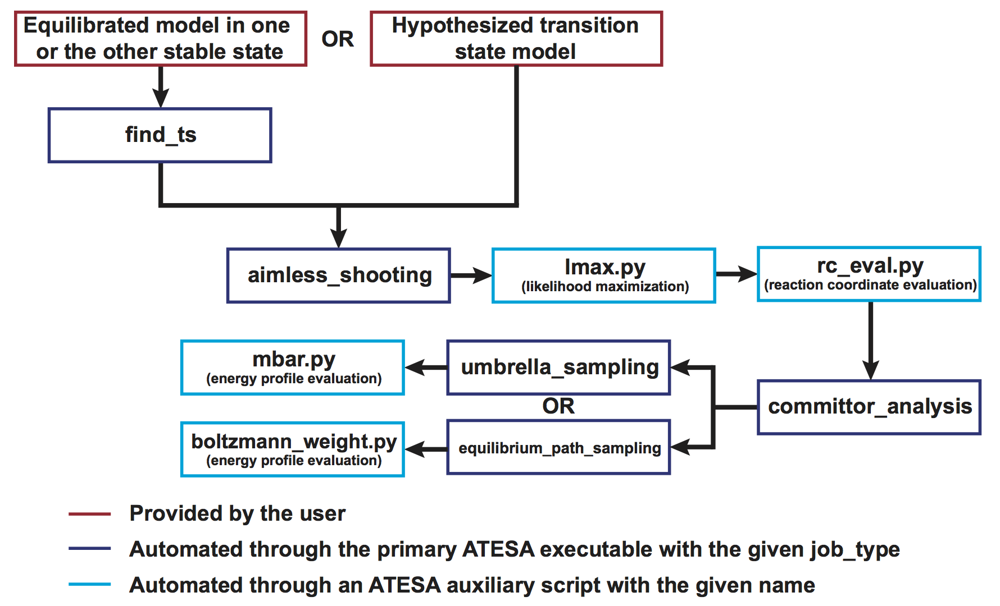

.. _TheConfigFile:

The Configuration File
======================

The configuration file is the primary means of controlling the behavior of ATESA. In order to support the wide array of functionality that any given user may need, the configuration file supports many options and can be quite long; however, in most cases a relatively short configuration file will be sufficient. This page provides some recommendations for building the configuration file for a handful of common use cases, and provides detailed documentation for each setting.

The contents of the configuration file are read into ATESA as literal python code, which enables invocation of python built-in functions as well as methods of pytraj and numpy. **Warning**: This input is not sanitized in any way. For this reason among others, "shutil.rmtree('/')" makes for a poor reaction coordinate!

.. toctree::
   :maxdepth: 3
   :caption: Contents of this page:
   
   the_config_file.rst

.. _CoreSettings:

Core Settings
-------------

Certain settings should be given for every job. The following settings do not have valid default values and should be set in every configuration file:

.. code-block:: python

	job_type		# Valid options: 'find_ts', 'aimless_shooting', 'committor_analysis', 'equilibrium_path_sampling'
	batch_system		# Valid options: 'slurm', 'pbs'
	restart			# Valid options: True, False
	overwrite		# Valid options: True, False
	topology		# Valid options: Absolute or relative path as a string
	working_directory	# Valid options: Absolute or relative path as a string
	
``job_type``

	The type of simulations to perform. Details on each type are given below in the :ref:`BasicWorkflow` section.
	
``batch_system``

	Indicates the type of batch system on which ATESA is running. Supported options are 'slurm' and 'pbs' (the latter is also known as TORQUE).
	
``restart``

	Indicates whether this is a new job (False) or a continuation of an old one *in the same working directory* (True).
	
``overwrite``

	Indicates whether to delete the existing working directory (if one exists) and create a new one *if and only if* restart = False (has no effect otherwise). If restart = False, overwrite = True will *always* delete the working directory if it exists; conversely, overwrite = False will *never* delete it (regardless of the "restart" setting).
	
``topology``

	An absolute or relative path given as a string and pointing to the simulation topology file.
	
``working_directory``

	An absolute or relative path given as a string and pointing to the desired working directory (this can be omitted if the working directory is set in the command line). This is the directory in which all of the simulations will be performed. It will be created if it does not exist.
	
.. _BasicWorkflow:

Basic Workflow
--------------

The following sections outline the contents of the configuration files for each part of a standard ATESA workflow. Following these steps will allow you to start with only a definition of each stable state and an model of one of them (or with a hypothesized transition state model, if preferred), and end with a validated reaction coordinate and a free energy profile along that coordinate connecting the two basins. The workflow of a complete transition path sampling workflow with ATESA is outlined graphically here.

If this is your first time performing simulations with ATESA for this particular molecular model, it would be wise to manually double-check that any output files and resulting trajectories from the first simulations performed by ATESA look like you expect them to. In particular, you should ensure that there are no errors being returned by your molecular dynamics software or batch system that would necessitate a change in the relevant files in the *input_files* or *templates* directories (see :ref:`SettingUpSimulationFiles` and :ref:`FilePathSettings`).

Find Transition State
~~~~~~~~~~~~~~~~~~~~~

If you want to perform aimless shooting but don't have a candidate transition state structure from which to begin (or just want to obtain more), ATESA can automatically build
them from a given product or reactant state structure. If you do already have a transition state candidate to begin with, you can skip this step. In addition to the :ref:`CoreSettings`, such a job should be set up as:

.. code-block:: python

	job_type = 'find_ts'
	initial_coordinates = [<coord_file_1>]
	commit_fwd = [...]
	commit_bwd = [...]
	max_moves = 5
	
In this case, <coord_file_1> should represent a structure in either the "fwd" or "bwd" commitment basin. See :ref:`CommitmentBasinDefinitions` for details on the `commit_fwd` and `commit_bwd` options.

The *find_ts* job type works by applying a modest restraint to the atoms that make up the target commitment basin definition in order to force the desired rare event to take place, and then automatically performing a small amount of aimless shooting from structures near the middle to identify suitable transition states. Working transition state structures are identified in the file "status.txt" in the subdirectory "as_test" created in the find_ts working directory. The aimless shooting portion can be safely interrupted if a suitable transition state (*i.e.*, one with a non-zero acceptance ratio) has been identified. This works better for some systems than others, and depending on the basin definitions may result in a transition state that technically falls along the separatrix, but is in fact far from the minimum energy transition path. The user should carefully sanity-check the resulting structure(s).

If find_ts gives you trouble, one alternative option for obtaining a good initial transition state structure is to run unbiased simulations at a high temperature to accelerate the transition, though this runs the risk of pushing the system into otherwise inaccessible configurations, and is beyond the scope of this documentation.

Aimless Shooting
~~~~~~~~~~~~~~~~

The most central function of ATESA is aimless shooting. If you have one or more initial transition structure guesses and want to begin transition path sampling, you should call ATESA with the following settings (in addition to the :ref:`CoreSettings` above):

.. code-block:: python

	job_type = 'aimless_shooting'
	initial_coordinates = [<coord_file_1>, <coord_file_2>, ...]
	cvs = [<cv1>, <cv2>, ...]
	commit_fwd = [...]
	commit_bwd = [...]
	
See :ref:`CommitmentBasinDefinitions` for details on the `commit_fwd` and `commit_bwd` options and :ref:`CVDefinitions` for details on the `cvs` option (the `cvs` option can be omitted if the *auto_cvs_radius* option is sufficient).

These settings will automatically use :ref:`InformationError` as a termination criterion with the default settings. These can be modified as described in :ref:`AimlessShootingSettings`.

While aimless shooting is running, you can check on its progress using the "status.txt" file found in the working directory. You should look for the average acceptance ratio across all threads to be in the range of at least 10-30%; lower values may indicate a poor initial transition state guess (see :ref:`Troubleshooting`).

Committor Analysis
~~~~~~~~~~~~~~~~~~

After completing aimless shooting, the next step is to obtain a reaction coordinate and verify it with committor analysis. Before running committor analysis, the user should call  likelihood maximization with their preferred settings (see :ref:`LikelihoodMaximization`) and then reaction coordinate evaluation using the aimless shooting working directory and the resulting reaction coordinate (see :ref:`RCEval`). 

Then, committor analysis is performed through the main ATESA executable with the following settings (in addition to the :ref:`CoreSettings` above):

.. code-block:: python

	job_type = 'committor_analysis'
	as_settings_file = <as_settings_file>
	path_to_rc_out = <rc_out_file>
	rc_threshold = <threshold>
	
The *as_settings_file* should point to the the "settings.pkl" file in the previous aimless shooting working directory; see the last entry in :ref:`CVDefinitions`. The *path_to_rc_out* option should point the output file of ``rc_eval.py``, which by default is named "rc.out" and located in the aimless shooting working directory. The value of *rc_threshold* should be selected by manually inspecting the file indicated by *path_to_rc_out* and finding the appropriate cutoff value to include the desired number of initial coordinates in committor analysis (a good choice is approximately 200). For example, if the absolute value of the 200th line of rc.out is 0.09, you might choose *rc_threshold* = 0.1. Note that larger values of rc_threshold make the result less powerful, as structures further from the transition state separatrix are included. If you feel you have to choose a large value of *rc_threshold* in order to include enough structures for committor analysis, it may indicate that you need to perform more aimless shooting.

The working directory here should NOT be the same as the aimless shooting directory containing the data to perform committor analysis with (although it can be a subdirectory). The aimless shooting directory will be identified as needed using the `path_to_rc_out` setting (which should be inside the aimless shooting working directory). The working directory for a committor analysis job should be a new directory, though it can be a subdirectory of the aimless shooting directory if desired.

The results of a committor analysis job are written to the file "committor_analysis.out" in the working directory. Each line in this file gives the ratio of jobs that committed to the "forward" basin to the total number of jobs that committed to either basin. For more details on interpreting these results, see :ref:`CommittorAnalysis`.

Umbrella Sampling
~~~~~~~~~~~~~~~~~

The final analysis step after a satisfactory committor analysis run is to obtain the free energy profile along the reaction coordinate. The preferred method for this is umbrella sampling, which is automated in ATESA for users with access to a build of Amber that supports the "irxncor=1" option (not yet publicly available as of May 2020; contact Michael F. Crowley at the National Renewable Energy Laboratory in Golden, CO if interested).

The conditions under which equilibrium path sampling should be used instead are as follows:

	* A version of Amber that supports umbrella sampling is not available; or

	* The desired reaction coordinate contains unusual CV types. The supported CV types are: distances, angles, dihedrals, and differences of distances. ATESA's automatically generated CVs are only ever of these types.

Umbrella Sampling can be called in ATESA through the main executable using the following settings (in addition to the :ref:`CoreSettings` above):

.. code-block:: python

	job_type = 'umbrella_sampling'
	rc_definition = <rc_definition>
	as_settings_file = <as_settings_file>
	as_out_file = <as_output_file>
	initial_coordinates = [<traj_file_1>, <traj_file_2>, ...]
	
The *as_settings_file* should point to the the "settings.pkl" file in the previous aimless shooting working directory; see the last entry in :ref:`CVDefinitions`. See :ref:`ReactionCoordinateDefinition` for details on the `rc_definition` option. The same *rc_definition* should be used for both committor analysis and umbrella sampling (or, if the *path_to_rc_option* was used for committor analysis, then the same for umbrella sampling and ``rc_eval.py``). The *as_out_file* option should point to the same file that was used as the input for the ``lmax.py`` run that generated the reaction coordinate being used.
	
The only unusual setting here is that the files pointed to in the *initial_coordinates* option can (and probably should) be *trajectories*, not single-frame coordinate files. These trajectories should represent at least one full transition path, from one basin to another. The easiest choice is to take the most recent accepted aimless shooting move and provide both its 'fwd' and 'bwd' trajectory files. ATESA will look through each frame of these trajectories to find the best initial coordinates for each sampling window.

Beyond these settings, the user will probably want to set the lower and upper bounds of the reaction coordinate to sample over. See :ref:`UmbrellaSamplingSettings` for details. After an umbrella sampling run, the data can be converted into a free energy profile using :ref:`MBAR`.

Equilibrium Path Sampling
~~~~~~~~~~~~~~~~~~~~~~~~~

As a more generalized but less efficient alternative to umbrella sampling, ATESA supports equilibrium path sampling (EPS) to obtain this profile through the main executable, using the following settings (in addition to the :ref:`CoreSettings` above):

.. code-block:: python

	job_type = 'equilibrium_path_sampling'
	rc_definition = <rc_definition>
	as_settings_file = <as_settings_file>
	as_out_file = <as_output_file>
	initial_coordinates = [<coord_file_1>, <coord_file_2>, ...]
	
The *as_settings_file* should point to the the "settings.pkl" file in the previous aimless shooting working directory; see the last entry in :ref:`CVDefinitions`. See :ref:`ReactionCoordinateDefinition` for details on the `rc_definition` option. The same *rc_definition* should be used for both committor analysis and equilibrium path sampling (or, if the *path_to_rc_option* was used for committor analysis, then the same for equilibrium path sampling and ``rc_eval.py``). The *as_out_file* option should point to the same file that was used as the input for the ``lmax.py`` run that generated the reaction coordinate being used. Finally, *initial_coordinates* can be used to select any number of coordinate files, usually taken from shooting points (coordinate files whose names end with "_init.rst7") from aimless shooting. By default, EPS windows that have fewer than 20 initial coordinate files are filled up by the endpoints of simulations in adjacent windows, but it is still advisable to provide at least a handful of unique starting structures.

Beyond these settings, the user will probably want to set the lower and upper bounds of the reaction coordinate to sample over. See :ref:`EquilibriumPathSamplingSettings` for details.

EPS is a highly generalized free energy method that does not rely on restraints or biases of any kind. The cost of this benefit is that it is also among the least efficient free energy methods available, requiring a relatively large amount of simulation to acquire comparable sampling coverage to, for example, umbrella sampling. For this reason, EPS is recommended for use only in cases where other methods are unsuitable or unavailable.

CAUTION: Because equilibrium path sampling measures the full energy profile instead of merely assessing the endpoints of simulations (as in aimless shooting and committor analysis), it is very sensitive to errors in the evaluation of the energy of any given state. For this reason, it is completely possible to have obtained reasonable aimless shooting and committor analysis results with a system or simulation parameters that are not suitable for equilibrium path sampling, for example owing to poor SCF convergence in QM calculations along portions of the RC. ATESA can NOT identify such errors on its own, and may produce EPS results that are not correct (but may appear reasonable at first glance)! It is the responsibility of the user to ensure that the EPS simulations are well-behaved and do not suffer from severe energetic or undersampling errors. Please direct any questions to `our GitHub page <https://github.com/team-mayes/atesa>`_ as an issue with the "question" label.

The raw output data from an EPS run is stored in the working directory as "eps.out". This data can be converted into an energy profile using boltzmann_weight.py (see :ref:`BoltzmannWeight`), which calculates the relative probabilities of states within each bin and converts these into relative free energies.
	

Full Configuration Options
--------------------------

Here, the full list of valid configuration file options are documented (excluding the :ref:`CoreSettings`, documented above.) **NOTE:** most options below will not need to be touched by most users. Exceptions (*i.e.*, options that basic users may or should be interested to set or change from their defaults) are denoted with a "‡".

.. _BatchTemplateSettings:

Batch Template Settings
~~~~~~~~~~~~~~~~~~~~~~~

These settings control how batch file templates are filled out. In general, 'init' simulations are very short (one step) and only used to prepare something for a longer simulation, whereas 'prod' simulations are where the primary data collection of a job takes place. When and whether 'init' or 'prod' variables are used is controlled by the job type.

These settings are used to fill in the template slots in the user-provided template files. If you do not wish for ATESA to use an option, you can simply omit its template slot from the appropriate file and leave it unset in the configuration file.

``init_nodes``

	The number of compute nodes to request for 'init' simulations, given as an integer. Default = 1

``init_ppn``

	The number of cores or processes to request per node (ppn: "processes per node") for 'init' simulations, given as an integer. Default = 1
	
``init_mem``

	The amount of RAM to request for 'init' simulations, given as a string of appropriate format for the batch system. Depending on the batch system, this may be interpreted as total memory, or as memory per core. Default = '4000mb'
	
``init_walltime``

	The amount of walltime (real time limit for the batch job) to request for 'init' simulations, given as a string of appropriate format for the batch system. 'init' simulations are very quick, but if one does not produce the necessary results in this time and is cancelled early, it will be resubmitted; err on the side of more time. Default = '00:30:00'
	
``init_solver`` **‡**

	The name of the executable to use to perform 'init' simulations, given as a string. Default = 'sander' (which is specific to Amber)
	
``init_extra``

	An additional template slot for 'init' simulations to be used however the user sees fit. This option is provided in case a user has an unforseen need to template something other than the above options. Default = '' (an empty string)
	
``prod_nodes`` **‡**

	The number of compute nodes to request for 'prod' simulations, given as an integer. Default = 1

``prod_ppn`` **‡**

	The number of cores or processes to request per node (ppn: "processes per node") for 'prod' simulations, given as an integer. Default = 8
	
``prod_mem`` **‡**

	The amount of RAM to request for 'prod' simulations, given as a string of appropriate format for the batch system. Depending on the batch system, this may be interpreted as total memory, or as memory per core. Default = '4000mb'
	
``prod_walltime``

	The amount of walltime (real time limit for the batch job) to request for 'prod' simulations, given as a string of appropriate format for the batch system. Err on the side of more time. Default = '02:00:00'
	
``prod_solver`` **‡**

	The name of the executable to use to perform 'prod' simulations, given as a string. Default = 'sander' (which is specific to Amber)
	
``prod_extra``

	An additional template slot for 'prod' simulations to be used however the user sees fit. This option is provided in case a user has an unforseen need to template something other than the above options. Default = '' (an empty string)

.. _FilePathSettings:

File Path Settings
~~~~~~~~~~~~~~~~~~

These settings define the paths where ATESA will search for user-defined input files and template files. They are used in all job types.

``path_to_input_files``	**‡**

	Absolute path (as a string enclosed in quotes) to the directory containing the input files. The default is the directory 'data/input_files' located inside the ATESA installation directory.

``path_to_templates``	**‡**

	Absolute path (as a string enclosed in quotes) to the directory containing the template files. The default is the directory 'data/templates' located inside the ATESA installation directory.

.. _CVDefinitions:

CV Settings
~~~~~~~~~~~

These settings define the combined variables (CVs) for the job. In aimless shooting, these are the values that are written to the output file for interpretation by likelihood maximization in building the reaction coordinate (RC). In equilibrium path sampling and committor analysis, they are used to evaluate the RC (see :ref:`ReactionCoordinateDefinition`). They are not used in ``find_transition_state`` jobs.

``cvs`` **‡**

	A list of CV definitions, given as strings, as in: [<cv1>, <cv2>, ... <cvN>] (where the contents of each pair of angled braces is a string). Each item is interpreted as raw python code (caution: unsanitized) that returns the desired CV value (in a format that can cast to a float). In addition to built-in python functions, calls to pytraj, mdtraj, and numpy (as both 'numpy' and 'np') are supported. In support of pytraj and mdtraj calls, the following variables are available for use in CV definitions:
	
		**traj**: the coordinate file being evaluated, as a pytraj.iterload object (for use with pytraj function calls). Note that pytraj returns units of angstroms and degrees for distances and angles, respectively.
		
		**mtraj**: the coordinate file being evaluated, as an mdtraj.load object (for use with mdtraj function calls). Note that mdtraj returns units of nanometers and radians for distances and angles, respectively.
	
		**traj_name**: the name of the coordinate file, as a string
	
		**settings.topology**: the name of the topology file, as a string
	
	These CV evaluations are only ever performed on coordinate files with a single frame (not multi-frame trajectories). It is up to the user to ensure that each item in *cvs* returns exactly the desired CV value as a float or integer (and not, for example, a one-length list containing that value). For example, the following value of *cvs* would interpret the interatomic distance between atoms 1 and 2 as CV1, the difference between the distances 3-to-4 and 5-to-6 as CV2, and the angle formed by atoms 7-8-9 as CV3 (all on one line):
	
        ::

	    cvs = ['pytraj.distance(traj, \'@1 @2\')[0]',
	           'pytraj.distance(traj, \'@3 @4\')[0] - pytraj.distance(traj, \'@5 @6\')[0]',
	           'pytraj.angle(traj, \'@7 @8 @9\')[0]']

	Notice in particular the usage of "traj" as the first argument in these pytraj function calls, the escaped single-quote characters within each function call, and the specification of the zero'th indexed item returned by each function call (as these pytraj functions return one-length lists). Keep in mind that by default, atoms referenced in pytraj are 1-indexed while in mdtraj they are 0-indexed. Default = ['']
	
.. _AutoCVs:
	
``auto_cvs_radius``	**‡**

	Alternatively or in addition to defining explicit CVs with the *cvs* option, this option can be used to automatically obtain and use CVs representing every 2nd, 3rd, and 4th order CV (bonds, angles, and dihedrals, respectively) consisting of contiguously bonded atoms within *auto_cvs_radius* angstroms of any of the atoms present in the the *commit_fwd* or *commit_bwd* options (see :ref:`CommitmentBasinDefinitions`). In addition, difference-of-distance CVs are produced wherever an atom appears in two or more elements in the commitment definitions. For example, if the following combination of settings is provided::

				commit_fwd = ([101, 102, 102], [103, 104, 105], [1.5, 2.0, 1.7], ['lt', 'gt', 'lt'])
				commit_bwd = ([101, 102, 102], [103, 104, 105], [2.0, 1.5, 2.5], ['gt', 'lt', 'gt'])
				auto_cvs_radius = 5    
	
	Then every bond, angle, and dihedral consisting of atoms within at least 5 angstroms of atoms 101, 102, 103, 104, or 105 (indexed from 1) would be included as a CV, in addition to the difference of distances 102-to-104 and 102-to-105. The index, description, and code used to evaluate each CV derived in this manner is printed to the file "cvs.txt" in the working directory. Automatic CVs can be disabled by setting *auto_cvs_radius* to 0. If *auto_cvs_radius* is greater than 0 and CVs are also defined manually using the *cvs* option, then the manually defined CVs are appended to the end of the list of automatically generated CVs.
    
	Using *auto_cvs* treats all of the atoms in *commit_fwd* and *commit_bwd* as bonded to one another for the purposes of determining CVs, so there is no need to define these CVs manually. Examples of CVs that *should* be defined manually if desired include any distances, angles, or dihedrals defined using atoms that are not contiguously bonded to one another (*e.g.*, a distance between nearby charged particles) and also do not appear in the commitment definitions, or any other custom CVs of unique relevance to the rare event of interest. Note that although commitment basin definitions (which are interpreted internally using pytraj) are always 1-indexed, the CV definitions produced automatically with this option are defined using mdtraj and will be 0-indexed. The software handles this distinction without issue, but the user must be careful not to confuse 0-indexed atom indices from "cvs.txt" with 1-indexed atom indices in the commitment basins.
    
	The number of CVs that are created using this option can grow very large very quickly when large radii are chosen, which in extreme cases can cause significant I/O overhead and slow down calls to :ref:`LikelihoodMaximization`. Default = 5

``auto_cvs_exclude_water``
	
	A boolean. By default, the behavior where *auto_cvs_radius* is greater than zero includes any water molecules within the given radius of the commitment-defining atoms. If *auto_cvs_exclude_water* is set to True, water molecules are excluded. They may still be included in CVs defined using the *cvs* option if desired. Default = False

``include_qdot``

	A boolean indicating whether the instantaneous rate of change of each CV defined in *cvs* should also be counted as a CV. These values can be used in inertial likelihood maximization to favor reaction coordinates with high transmission coefficients (see `Peters 2012 <https://doi.org/10.1016/j.cplett.2012.10.051>`_ and/or :ref:`LikelihoodMaximization`). Rate of change CVs come after the rest of the CVs in the aimless shooting output file, as in:
	
	::
	
	<basin> <- <CV1> <CV2> ... <CVn> <qdot1> <qdot2> ... <qdotn>
	
	Default = True

``as_settings_file`` **‡**

	A string pointing to a previously generated "settings.pkl" file. These files are produced in the working directory whenever ATESA is run. By pointing a new ATESA job to the settings.pkl file of a previous one using this option, the CVs and commitment basin definitions from that run are loaded. The loaded settings take priority, and the following configuration file options will be ignored if an *as_settings_file* is indicated::
	
		cvs
		commit_fwd
		commit_bwd
		include_qdot
		auto_cvs_radius
		auto_cvs_exclude_water
	
	Use of this option is recommended in particular for committor analysis, umbrella sampling, and equilibrium path sampling jobs following an aimless shooting job. In this case, the *as_settings_file* should point to the settings.pkl file from that aimless shooting job. Default = ''

Initial Coordinates
~~~~~~~~~~~~~~~~~~~

``initial_coordinates`` **‡**

	The initial coordinates for the job, used as appropriate for the given job type, given as a list of strings. All jobs require initial coordinates (although in committor analysis they may be identified using the *path_to_rc_out* option instead, if *committor_analysis_use_rc_out* is True (which is not the default), and in umbrella sampling they may be identified automatically if *us_auto_coords_directory* is set). All the coordinate files identified in this list are used to spawn independent threads. The same file can be given more than once to spawn multiple threads with the same initial coordinates. Default = ['']

.. _CommitmentBasinDefinitions:

Commitment Basin Definitions
~~~~~~~~~~~~~~~~~~~~~~~~~~~~

These options define the geometric boundaries past which simulations are considered to have committed to the specified energetic basin (usually either "products" or "reactants"). In general, the basin definitions should be chosen so as to be mutually exclusive and deep enough into the state that they represent to ensure that simulations are not terminated before they have truly "committed" that a given basin. When in doubt, choose a more conservative basin definition.

Commitment basin definitions are required in aimless shooting, committor analysis, and find transition state, but are not used for equilibrium path sampling.

``commit_fwd``	**‡**

	The definition of the "forward" basin (usually products). The syntax for this option is as follows::
			
		commit_fwd = ([index_1a, index_1b, ... index_1n], [index_2a, index_2b, ... index_2n],
		[dist_1, dist_2, ... dist_n], ['gt'/'lt', 'gt'/'lt', ... 'gt'/'lt']

	This is interpreted as: the distance between the atoms with indices *index_1a* and *index_2a* must be either greater than (*'gt'*) or less than (*'lt'*) the distance dist_1 (in Å), and so on. Atom indices are strictly 1-indexed; if the model itself is 0-indexed, you need to increment each index by one when including it in commitment basin definitions. Each item in each list sharing the same subindex (*e.g.*, index_1a, index_2a, dist_1, and the first 'gt'/'lt') is treated as a single criterion for commitment to the basin, and only once ALL the criteria are met simultaneously is the simulation considered committed. No default value.
	
``commit_bwd`` **‡**

	This options behaves just like *commit_fwd*, but for the "backward" basin (usually reactants). No default value.

.. _ReactionCoordinateDefinition:

Reaction Coordinate Definition
~~~~~~~~~~~~~~~~~~~~~~~~~~~~~~

The options define the reaction coordinate (RC) in terms of the CVs in the *cvs* options (see :ref:`CVDefinitions`). These options are only used in committor analysis and equilibrium path sampling.

``rc_definition`` **‡**

	The RC definition itself as a string. This string is interpreted as raw python code, with each CV term replaced by the appropriate value. For example::
		
		rc_definition = '-0.52 + CV4*1.23 - CV2/CV25'

	would be interpreted as -0.52 plus the value of CV4 (the fourth item of *cvs*, one-indexed), minus the ratio of the values of CV2 and CV25. No default.
	
``rc_reduced_cvs``

	A boolean indicating whether the CVs in *rc_definition* should be normalized to between 0 and 1 using the minimum and maximum values observed (True), or if the raw values should be used (False). Default = True
	
``as_out_file`` **‡**

	Path to an aimless shooting output file. The minimum and maximum values of each CV contained herein are used to reduce the CV values in the RC if *rc_reduced_cvs = True* (otherwise this option is unused). The CVs must be given in the same order in this file as they are in the *cvs* option (as is the case if the same *cvs* option was used in the aimless shooting run that produced this file). This option must be set explicitly if the aimless shooting output file is not present in the working directory, as is usually the case by default in committor analysis and equilibrium path sampling. Default = 'as_raw.out'

.. _AimlessShootingSettings:

Aimless Shooting Settings
~~~~~~~~~~~~~~~~~~~~~~~~~

These settings are specific to aimless shooting runs only.

``min_dt``

	When a shooting move is accepted, the next move begins from an early time step of the accepted trajectory. This option sets the minimum number of simulation time steps away from the initial coordinates that the initial coordinates of the next move may be (in either direction). Higher options will explore the configuration space more quickly, but will decrease the move acceptance ratio. Default = 1
	
``max_dt``

	As *min_dt*, but sets the maximum number of steps. The number of steps can be fixed by setting both options to the same value. Higher options will explore the configuration space more quickly, but will decrease the move acceptance ratio. Default = 10

``always_new``
	
	A boolean. If True, failed shooting moves pick a new frame in the range of *min_dt* to *max_dt* from the last accepted trajectory in the thread as their initial coordinates for the next attempt. If False, the same coordinates are used repeatedly with only the velocities randomized at each step. Default = True
	
``resample``

	A boolean. If True, aimless shooting will NOT be performed, and instead the existing aimless shooting data found in *working_directory* are used to produce new output files based on the settings of the current ATESA job. The primary usage of this option is to add additional CVs to the output files without needing to repeat any simulations. Default = False
	
``degeneracy`` **‡**

	An integer number of "degenerate" threads to begin from each given initial coordinate file. This option is merely a shortcut for increasing the degree of parallelization in the sampling process, but keep in mind that higher values sample less efficiently, especially for systems that decorrelate slowly and/or when *min_dt* and *max_dt* are small. Default = 1 (no degeneracy, only one thread per initial coordinate file)
	
``cleanup``

	A boolean. If True, trajectory files for each shooting move are deleted after they no longer represent the last accepted trajectory in a thread. The initial coordinate files from each shooting move are always retained for resampling. This option is useful to reduce the amount of storage space consumed in the course of aimless shooting; however, note that when this option is used, you will not be able to completely resample the output file "as_full_cvs.out" if you later want to add additional CVs. This file is only used for an optional setting in umbrella sampling, so if you don't plan to use umbrella sampling you can safely set this to True. Default = False
	
``max_moves``

	The maximum number of moves that an aimless shooting thread can make before terminating. This can be useful for limiting the amount of resource consumption for each thread. If a negative value is given, there is no limit. Default = -1
	
``max_consecutive_fails``

	The maximum number of consecutive failed shooting moves permitted before the entire aimless shooting run terminates. This option is useful for placing a lower limit on the acceptance ratio so as to avoid spending a lot of resources on inefficient sampling. It does not terminate just the individual thread, because to do so would bias the sampling procedure. If a negative value is given, there is no limit. Default = -1
	
The following options concern the information error convergence criterion in aimless shooting, which is turned on by default. See :ref:`InformationError` for a general description of this method.
	
``information_error_checking``

	A boolean. If True, the information error convergence criterion is used to terminate aimless shooting once the mean parameter standard error falls below the *information_error_threshold*. If False, none of the other options beginning with "information_error" are used. Default = True
	
``information_error_threshold``

	The threshold of mean parameter standard error below which the information error termination criterion is satisfied and aimless shooting ends. Error generally diminishes as the square root of the number of samples, so an order of magnitude lower threshold requires a hundred times more sampling (assuming that the CVs constituting the maximum likelihood model remain the same throughout). It is a good practice to manually inspect the *info_err.out* file in the working directory after termination to ensure that it appears to be converged to within the user's desired tolerance. Default = 0.1
	
``information_error_freq``

	An integer number of shooting moves between each check of the information error convergence criterion. Too-small values can cause some significant overhead in the main ATESA process, but this does not significantly affect aimless shooting sampling efficiency. Default = 250
	
``information_error_max_dims``

	The maximum number of dimensions that may be included in the "automagic" reaction coordinate assessed during information error checking (see :ref:`Automagic`). If this value is set, the algorithm will move forward with a model of this dimensionality if no smaller model meets the automagic convergence criteria. Larger values are more robust but may result in an undesirably high-dimensional RC being used for the convergence criterion, which in turn could lead to slower convergence of the information error. If a value less than zero is given, there is no maximum. Default = 6
	
``information_error_override``

	A boolean. The default likelihood maximization procedure with automagic raises an exception if even an RC with every single candidate CV included is unable to pass the automagic convergence criteria. This generally indicates that one or more important CVs are missing from consideration (in the *cvs* option). If this option is set to True, the exception is bypassed and the largest-dimensional RC available is used. Use with caution. Default = False
	
``two_line_threshold``

	A float defining the maximum ratio of the slopes of the lines constituting one of the likelihood maximization "automagic" algorithm's convergence criteria. See :ref:`Automagic` for details. Default = 0.5

Committor Analysis Settings
~~~~~~~~~~~~~~~~~~~~~~~~~~~

These options are specific to committor analysis runs only.

``committor_analysis_n``

	The number of independent simulations to run *for each initial structure* during committor analysis. This number should be large enough to distinguish confidently between structures that make good and poor transition states. The default choice is safe. Default = 10.
	
``committor_analysis_use_rc_out``

	A boolean. If True, the choice of initial coordinates is based not on the *initial_coordinates* option in the configuration file, but on the contents of an RC output file, based on the following two options. Default = False
	
``path_to_rc_out``

	The path to the RC output file, given as a string. This file should contain the name of each shooting move file (aimless shooting files ending in '*_init_fwd.rst7') followed by a colon, a space, and then the value of the reaction coordinate at that point. For example::
		
		initial_coords_1_1_init_fwd.rst7: -0.0913
		initial_coords_1_2_init_fwd.rst7: -0.1125

	Files of this sort can be automatically generated using the auxiliary script :ref:`RCEval`. No default.
	
``rc_threshold``

	The threshold of *absolute value* of reaction coordinate below which shooting moves in the indicated *path_to_rc_out* file will be included in committor analysis. For example, if the above example contents of such a file were used and *rc_threshold* were set to 0.1, only the first of the two files (initial_coords_1_1_init_fwd.rst7) would be used for committor analysis. The user is encouraged to check the RC output file manually before using this option to ensure that they will have enough unique initial coordinate files to produce a useful committor analysis result (200 files is a good target). Default = 0.05

.. _UmbrellaSamplingSettings:	
	
Umbrella Sampling Settings
~~~~~~~~~~~~~~~~~~~~~~~~~~

These options are specific to umbrella sampling (US) runs only. They mostly pertain to defining the restraints. It may be useful to run a test run first with only a few windows along a small subset of the full range of reaction coordinate values to verify these settings before continuing.

Keep in mind that if you perform a large amount of sampling and then discover that there are gaps in your sampling, you can always submit a new umbrella sampling job (in a new working directory) with the same settings but with windows centered in the gaps, and then copy the resulting output data files (named with "_us.dat") to the original working directory to include them all in the same analysis.

``us_rc_min`` **‡**

	The minimum value of the reaction coordinate to sample during US. It can be useful to manually evaluate the RC of an equilibrated reactant state structure, and then add some small fraction of that number again (say, 10%) to select the value for this option. Default = -12
	
``us_rc_max`` **‡**

	The maximum value of the reaction coordinate to sample during US. It can be useful to manually evaluate the RC of an equilibrated product state structure, and then add some small fraction of that number again (say, 10%) to select the value for this option. Default = 12
	
``us_rc_step``

	The step size between the centers of adjacent windows during US. Window boundaries are assigned from the left, such that the first window always begins exactly at *us_rc_min*, and then steps of size *us_rc_step* delineate further windows until the next step would be equal to or greater than *us_rc_max*. Default = 0.25
	
``us_restraint``

	The weight of the energetic restraint applied in each US window, measured in kcal/(mol-units^2), where "units" is the dimensionality of the reaction coordinate. Too-low values sample inefficiently, but too-high values necessitate more windows along the RC so as not to leave gaps. In general, you should select a value that produces about 10-to-20% overlap in sampling with neighboring windows on either side, which may require some trial-and-error, as the appropriate values to choose will depend on the underlying free energy profile and the simulation parameters. The default values are a good starting point for most systems (at 300 K -- significantly lower temperatures require weaker restraints and *vice versa*). Default = 50
	
``us_degeneracy``

	The number of independent threads to run *for each window* during umbrella sampling. Setting it to 1 or less means only one thread per window. This should usually be a small number greater than one. If this option is combined with *us_auto_coords_directory*, each of the independent threads will correspond to initial coordinates taken from a different accepted aimless shooting trajectory; otherwise, they will all start from the same coordinates. Default = 5
	
``us_auto_coords_directory`` **‡**

	By default, umbrella sampling uses initial coordinates generated from the files designated in the *initial_coordinates* option. Alternatively, and more conveniently, this option can be used to specify an aimless shooting working directory from which to automatically identify suitable initial coordinates using *n* of the most recent "accepted" trajectories from the aimless shooting threads, where *n* is the value of *us_degeneracy*. If this option is used, the contents of *initial_coordinates* will be ignored. Default = ''
	
``us_cv_restraints_file``

	A string giving the path to the full CVs output file (default name "as_full_cvs.out") in the desired aimless shooting working directory. By default, the restraints applied during umbrella sampling are only along the reaction coordinate, with all other degrees of freedom left unrestrained. In some cases, this can result in errant sampling of regions of state space that technically have the desired reaction coordinate value, but do not actually fall within the transition path ensemble. Such errors are usually visible in umbrella sampling output data as discontinuities in the mean value plot produced by the mbar.py analysis script; see the :ref:`UmbrellaSamplingTroubleshooting` section of the :ref:`Troubleshooting` page for more information. One possible way to fix this is by rerunning umbrella sampling with this option set, which will apply restraints to every CV included in the aimless shooting output files. These restraints are flat and equal to zero within the range of values observed during any accepted aimless shooting trajectory, and then increase in energy steeply outside this range. In this way, and to the extent that aimless shooting explored the relevant phase space of each CV and that the included CVs cover the relevant dimensions, this option requires the umbrella sampling simulations to remain within the reaction pathway ensemble, producing much better results. However, because of the risk that important regions of state space are errantly gated off, this option should only be used as necessary, not as a first-resort. **Important:** If this option is set, you must include 'nmropt=1,' in the &cntrl namelist of the 'umbrella_sampling_prod_amber.in' file in the templates directory. Default = ''

.. _EquilibriumPathSamplingSettings:

Equilibrium Path Sampling Settings
~~~~~~~~~~~~~~~~~~~~~~~~~~~~~~~~~~

These options are specific to equilibrium path sampling (EPS) runs only.

``eps_rc_min`` **‡**

	The minimum value of the reaction coordinate to sample during EPS. It can be useful to manually evaluate the RC of an equilibrated reactant state structure, and then add some small fraction of that number again (say, 10%) to select the value for this option. Default = -12
	
``eps_rc_max`` **‡**

	The maximum value of the reaction coordinate to sample during EPS. It can be useful to manually evaluate the RC of an equilibrated product state structure, and then add some small fraction of that number again (say, 10%) to select the value for this option. Default = 12
	
``eps_rc_step``

	The step size between the centers of adjacent windows during EPS. Window boundaries are assigned from the left, such that the first window always begins exactly at *eps_rc_min*, and then steps of size *eps_rc_step* delineate further windows until the next step would be equal to or greater than *eps_rc_max*. Default = 1
	
``eps_rc_overlap``

	The amount of overlap between adjacent windows. This is in addition to the boundaries calculated with the above three options and can extend past the edges; for example, if the windows without overlap had been bounded as:
	
		::

		[[-2, -1], [-1, 0], [0, 1], [1, 2]]
		
	Then with overlap of 0.1, the new boundaries would be:
	
		::
		
		[[-2.1, -0.9], [-1.1, 0.1], [-0.1, 1.1], [0.9, 2.1]]
		
	Default = 0.1
	
``eps_n_steps``

	The number of simulation timesteps to include in each EPS trajectory. Larger numbers explore more of the energy profile per simulation and may converge more quickly, but are more likely to exit their assigned window and not be counted (in whole or in part) (especially when the energy profile is very steep) and so could be less computationally efficient. Default = 6
	
``eps_out_freq``

	The number of steps in each trajectory between writes to the EPS output file. The *eps_n_steps* option must be divisible by this number. Default = 1
	
``eps_dynamic_seed``

	An option for automatically building new EPS threads from the tails of simulations in adjacent windows. This option can either be supplied as an integer or as a list of integers of length equal to the number of EPS windows. If just an integer is supplied, it is treated as a list of that length where each item is that integer. The value in each index in this list indicates the number of independent threads each window should support. As long as a window has fewer than this number of threads, every time a simulation in an adjacent window contains frames inside the window in question a new independent thread will begin from the earliest such frame. Only one new thread can begin from any given trajectory. Using this option it is possible to obtain a full energy profile along the RC using only a single coordinate file located at the transition state; however, use of this option can slow down convergence of the sampled distribution towards the equilibrium distribution. It is the responsibility of the user to ensure that their final dataset is equilibrium-distributed. Default = 20
	
``samples_per_window``

	A termination criterion for EPS that terminates the sampling in a given EPS window after this number of samples within it have been written to the EPS output file. Negative values mean no limit; sampling will continue indefinitely (until ATESA is terminated by other means). Default = -1

Other Settings
~~~~~~~~~~~~~~

The following settings don't belong anywhere else in particular.

``restart_terminated_threads``

	A boolean. If True and if the *restart* option is also True, threads that had already terminated for any reason will be restarted along with the rest of the threads. If whatever termination criterion that caused a thread to terminate is still met after a single additional step, it will be terminated again. Default = False
