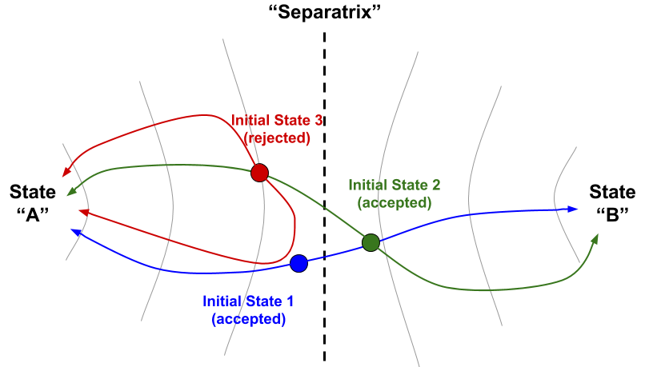
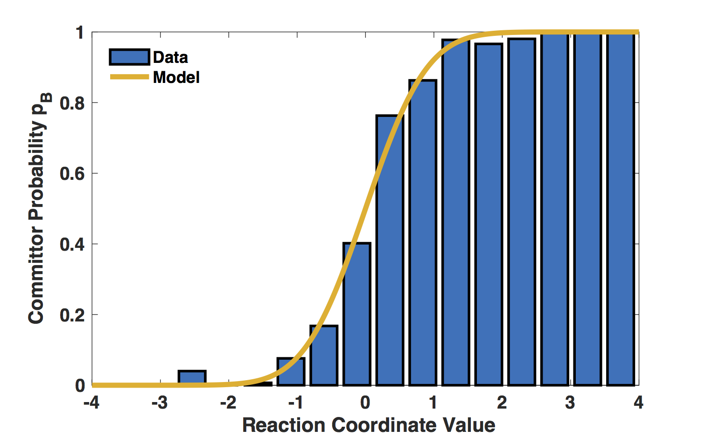
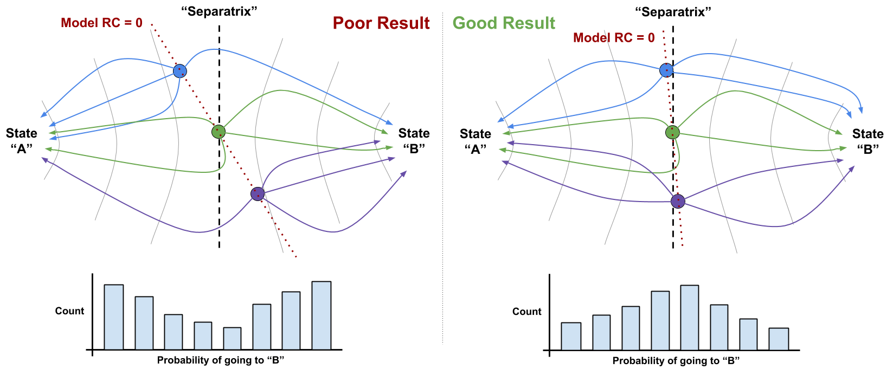
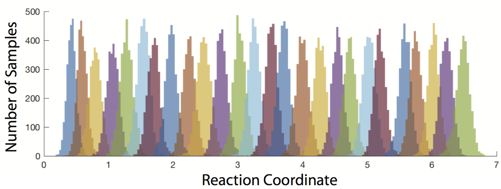
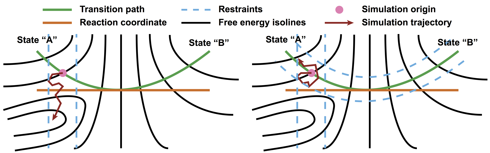

.. _TheoryAndDefinitions:

Theory and Definitions
======================

This page is intended to briefly introduce readers who may not be familiar with the theory of rare event sampling to some of the theory and vocabulary of transition path sampling (TPS) with aimless shooting, as well as to how ATESA implements them. It is intended for prospective users who may not yet be sure whether TPS or ATESA is right for their application. A thorough explanation of TPS as a technique and its relationship to other methods is beyond the scope of this document; for this the reader is instead directed to `Beckham and Peters, 2010 <https://pubs.acs.org/doi/abs/10.1021/bk-2010-1052.ch013>`_.

Why Do Rare Event Sampling?
---------------------------

Molecular simulations are a powerful tool for investigating the workings of chemical systems at the extremely small scale. However, due to technical limitations, simulations are necessarily quite limited in scope and cannot replicate the time- and length-scales relevant in laboratory studies. This can be particularly troublesome when the important feature of a system is a chemical reaction or transformation with a significant activation barrier; although such an event may take place very quickly in the eyes of an experimentalist, it could take years of computer time before the same event might be expected to occur just once in a simulation. This is what is meant when we call certain reactions or transformations "rare events".

In order to apply simulations to the study of rare events, we must make use of advanced sampling methods. These methods take advantage of knowledge about the system or about chemistry in general to modify the behavior of simulations and narrow their focus to a particular event or events and allow them to be simulated on tractable timescales. In particular, ATESA automates a transition path sampling workflow using aimless shooting.

What is Transition Path Sampling?
---------------------------------

Transition path sampling refers to any method of rare event sampling that aims to characterize the ensemble of "transition paths" (that is, trajectories through phase space that connect one discrete state to another) as a means of characterizing the rare event as a whole. You should look towards transition path sampling methods when you want to characterize *how* a rare event occurs from beginning to end with minimal bias. For instance, you might use transition path sampling methods to discover the key parameters that describe a change in the configuration of a structure, or to determine the chemical mechanism of a reaction.

What is Aimless Shooting?
-------------------------

Aimless shooting is a transition path sampling method for performing efficient, unbiased sampling of the region(s) of phase space corresponding to the ensemble of transition states. Because by definition the transition state is a local maximum in energy along at least one dimension, this region is difficult to sample using conventional simulations -- that is, a transition is a rare event. The aimless shooting approach is to leverage one or more putative or “guess” transition state structures (which are obtained by other methods as a prerequisite to beginning aimless shooting, though ATESA is equipped with a tool to help do so), which will be “aimlessly” “shot” through phase space using unbiased initial velocities chosen from the appropriate Boltzmann distribution. The resulting trajectory is at the same time also simulated in reverse (using initial velocities of opposite direction and equal magnitude), and if after simulations the two trajectories converge to different pre-defined energetic basins (*e.g.*, one "products", one "reactants"), then the reactive trajectory connecting them is considered a success. New starting points are daisy-chained from older successful ones by taking an early frame from the reactive trajectory as the initial coordinates, and in this way it is ensured that sampling remains nearby the transition state separatrix (that is, the surface in phase space that divides the products from the reactants with equal commitment probability in either direction).

	An example of three aimless shooting moves in a hypothetical 2-D state space. Each shooting move consists of an initial coordinate (colored circle) from which two trajectories begin in opposite directions (colored lines). If the two trajectories go to opposite basins ("A" and "B"), then the move is accepted and new initial coordinates for the next step are chosen from an early part of the accepted trajectory (as move 2 (green) begins along the pathway from move 1 (blue)). If a move is not accepted (move 3 (red)), then the next step would begin from a different point and/or with different initial velocities from the previous accepted move (not shown).
	
When is Aimless Shooting the Right Tool?
----------------------------------------

Of course, aimless shooting is not always to best tool for the job. Efficiency aside, the primary advantage of aimless shooting compared to other path sampling tools is that it is completely unbiased; the only thing you need to get started is a way to distinguish one state from the other, and a guess about what lies in between. If you're unsure whether aimless shooting is the best option for your application, consider the following:

- Aimless shooting is designed to focus sampling around transition states, rather than at the stable states that they connect. If you are more interested in comparing properties of stable states than in understanding how one transitions to another, aimless shooting is not the right tool.

- Aimless shooting is best used to discover or describe a mechanism when one is unknown. If you have a reaction coordinate or collective variable that describes the transformation already in mind and just want to characterize it, you may look to a pathway free energy method like umbrella sampling or equilibrium path sampling (the latter of which is implemented in ATESA), or a path sampling method that makes use of a known collective variable like transition interface sampling.

- Like all transition path sampling methods, aimless shooting is at its best where the energy barrier is high (and therefore transitions are rare). If your transition occurs quickly enough to reasonably observe many times over the course of an unbiased molecular dynamics or quantum mechanics simulation, aimless shooting may be overkill.

- Aimless shooting is the best tool when you are interested in efficiently arriving at an accurate description of the transition state of a rare event without specifying a mechanism *a priori*.

What is ATESA, and Why Should I Use It?
---------------------------------------

ATESA is a Python program that implements aimless shooting and several attendant setup and/or analysis methods, with the intent of expediting the full workflow and making it readily accessible to non-experts without requiring them to write (or read!) code. It automates the aimless shooting process with a system of independent “threads” representing one particular path in the search through phase space. A thread has a given set of initial coordinates, which it repeatedly “shoots” until it finds a successful reactive trajectory, at which point it picks a new shooting point on the reactive trajectory and continues. Because threads run entirely in parallel and ATESA supports multiprocessing, aimless shooting with ATESA scales almost perfectly so long as sufficient computational resources are available.

ATESA also features a suite of analysis and utility tools that run in much the same fashion. It can be used to obtain an initial transition state guess to seed aimless shooting based on definitions of the stable states, and once aimless shooting has been completed (see :ref:`OnTerminationCriteria`), ATESA can be used to automate likelihood maximization to "mine" the data for a reaction coordinate that describes the transition path, committor analysis to verify that reaction coordinate, and equilibrium path or umbrella sampling to obtain the free energy profile along it.

By design, ATESA is suitable for researchers who are familiar with the basic tenants of molecular simulation, but may not be experts in Python or in rare event sampling. By providing tools and guidance for a ready-made workflow from start to finish, ATESA aims to take the guesswork out of adding transition path sampling to your toolkit. For details on implementing this workflow, see :ref:`BasicWorkflow`.

.. _LikelihoodMaximizationTheory:

What is Likelihood Maximization?
--------------------------------

The output of aimless shooting is a large set of combined variable (CV) values paired with corresponding commitment basins (products or reactants). In order to convert this information into a usable form, the method of likelihood maximization can be used to select a model that describes the reaction progress in terms of relatively few parameters. ATESA supports the inertial likelihood maximization procedure first published in `Peters 2012 <https://doi.org/10.1016/j.cplett.2012.10.051>`_, in addition to the original non-inertial procedure. For details on ATESA's implementation of likelihood maximization, see :ref:`LikelihoodMaximization`.

	An example depicting the fitting of a reaction coordinate model (yellow line) to aimless shooting data (blue histogram). Good fit between the histogram and the model is a necessary-but-not-sufficient condition for a good reaction coordinate.
	
.. _CommittorAnalysis:

What is Committor Analysis?
---------------------------

Once a reaction coordinate has been obtained, it should be verified using new, unbiased simulations that were not included in the model training dataset. The method of committor analysis is to simply select a large number (hundreds) of initial coordinates with reaction coordinate values very close to zero (the predicted transition state) and run several unbiased simulations starting from each of them to verify that they are as likely on average to proceed towards the reactants as towards the products. The extent to which this likelihood is clustered around 50% probability of either outcome is a measure of the effectiveness of the reaction coordinate in describing the transition state.

	An pair of examples of committor analysis. At left, a "poor" model misjudges the reaction coordinate (RC) and the resulting committor analysis distribution (at bottom) is bimodal at either end. At right, a much better model closely matches its predicted separatrix (RC = 0) with the "real" separatrix, resulting in a unimodal distribution centered near 1/2.
	
What is Umbrella Sampling?
--------------------------

ATESA's preferred method for obtaining a free energy profile along a determined reaction coordinate is umbrella sampling. This is a fairly simple method where many simulations beginning along different portions of the reaction coordinate are restrained to that portion using a harmonic bias. The shape of the resulting distribution of reaction coordinate values sampled over the course of the simulations can be interpreted to measure the underlying free energy profile by "subtracting" the influence of the known harmonic restraints using any of a number of algorithms (one of which, the Multistate Bennett Acceptance Ratio, or "MBAR", is automated in ATESA using the `pymbar <https://github.com/choderalab/pymbar>`_ package).

	An example of the raw sampling data from an umbrella sampling job. Colors alternate to help distinguish different simulations, with adjacent simulations overlapping in sampling to avoid gaps. This data can be directly interpreted using MBAR to obtain a free energy profile.

Umbrella sampling is a very efficient free energy method, but its primary limitation is the requirement that a restraint can be defined along the desired reaction coordinate. ATESA automatically handles these restraints using PLUMED or Amber's irxncor module, if available.

.. _UmbrellaSamplingPathwayRestraints:

What is Pathway-Restrained Umbrella Sampling?
---------------------------------------------

In addition to automating traditional umbrella sampling, ATESA features a novel method for constraining the sampling within the known transition pathway ensemble. Although committor analysis can be used to confirm that the chosen reaction coordinate contains all of the key CVs to describe the transition state ensemble, one of the weaknesses of this analysis is that there is no guarantee that the appropriate set of CVs to describe the transition pathway ensemble remains the same along the full path from one stable state to the other. This can pose a problem when attempting to apply umbrella sampling along the reaction coordinate: if there exist any dimensions along which the transition pathway ought to be restrained for some portion of it, but those dimensions ought *not* to be restrained at the transition state (where the reaction coordinate was defined), then relaxation along those dimensions will result in misjudging the shape of the free energy profile along those portions during umbrella sampling.

Fortunately, sampling data from aimless shooting can be leveraged to address this issue. To the extent that aimless shooting explored the ensemble of transition pathways, the regions of state space represented among its accepted trajectories describe the boundaries of the transition pathway in every dimension (not just those that contribute to the reaction coordinate). Our approach, which we call “pathway-restrained” umbrella sampling, is to apply additional restraints during umbrella sampling simulations to every dimension that was recorded during aimless shooting. The restraints have flat (zero) weight in the range of values observed during frames of accepted aimless shooting trajectories with reaction coordinate values closest to the umbrella sampling window in question, and steeply increasing weight outside that range. As a result, each umbrella sampling simulation is only able to explore the same regions of state space that were already explored along the corresponding point along the transition pathway during aimless shooting.

	Schema depicting a simple free energy surface on which umbrella sampling is being performed with and without pathway restraints derived from aimless shooting data. Likelihood maximization optimizes the reaction coordinate only at the separatrix, where the orange and green lines intersect. The lack of pathway restraints in the scheme at left leaves the depicted simulation trajectory free to relax into the off-pathway free energy basin, which would cause errors in measuring the free energy along the pathway. At right, pathway restraints are added to prevent this. Note that in practice umbrella sampling restraints are harmonic, not rigid walls as depicted here for clarity.

Warning: pathway restraints have the potential to impart additional error during umbrella sampling, and so should only be used when necessary, not as a first resort. See :ref:`UmbrellaSamplingTroubleshooting` for a discussion on when pathway restraints are warranted.

Pathway-restrained umbrella sampling is implemented in ATESA by: first, obtaining an "as_full_cvs.out" file by running aimless shooting with the *full_cvs = True* option, or resampling a completed aimless shooting job that was run with *cleanup = False* with the options *resample = True* and *full_cvs = True*; and then running umbrella sampling with the *us_pathway_restraints_file* option pointing to that "as_full_cvs.out" file.

What is Equilibrium Path Sampling?
----------------------------------

Although it is efficient, umbrella sampling is not always suitable for every reaction coordinate. The most general pathway free energy method is equilibrium path sampling, wherein the reaction coordinate is divided into bins and the unbiased distribution of reaction coordinate values sampled within those bins is converted directly into free energy. This method requires no restraints or external packages, and so supports competely arbitrary reaction coordinates. ATESA automates collection of equilibrium path sampling data from an arbitrary array of initial coordinates, filling in gaps automatically using the tails of simulations from adjacent windows. Note that the tradeoff for the generality of this method is that it can be highly resource-inefficient compared to umbrella sampling, especially for rare events with high activation energies.